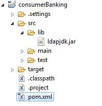

# Maven 

[TOC]

## 1. 概述

### 1.1 Maven 是什么

Maven 是一个项目管理和整合工具。Maven 为开发者提供了一套完整的构建生命周期框架。开发团队几乎不用花多少时间就能够自动完成工程的基础构建配置，因为 Maven 使用了一个标准的目录结构和一个默认的构建生命周期。

在有多个开发团队环境的情况下，Maven 能够在很短的时间内使得每项工作都按照标准进行。因为大部分的工程配置操作都非常简单并且可复用，在创建报告、检查、构建和测试自动配置时，Maven 可以让开发者的工作变得更简单。

Maven 能够帮助开发者完成以下工作：

- 构建
- 文档生成
- 报告
- 依赖
- SCMs
- 发布
- 分发
- 邮件列表

总的来说，Maven 简化了工程的构建过程，并对其标准化。它无缝衔接了编译、发布、文档生成、团队合作和其他任务。Maven 提高了重用性，负责了大部分构建相关的任务。

### 1.2 Mavne 的目标

Maven 的主要目的是为开发者提供

- 一个可复用、可维护、更易理解的工程综合模型
- 与这个模型交互的插件或者工具

Maven 工程结构和内容被定义在一个 xml 文件中 － pom.xml，是 Project Object Model (POM) 的简称，此文件是整个 Maven 系统的基础组件。

### 1.3 约定优于配置

Maven 使用约定而不是配置，意味着开发者不需要再自己创建构建过程。

开发者不需要再关心每一个配置细节。Maven 为工程提供了合理的默认行为。当创建 Maven 工程时，Maven 会创建默认的工程结构。开发者只需要合理的放置文件，而在 pom.xml 中不再需要定义任何配置。

举例说明，下面的表格展示了工程源码文件、资源文件的默认配置，和其他一些配置。假定 `${basedir}` 表示工程目录：

| 配置项                | 默认值                           |
| ------------------ | ----------------------------- |
| source code        | ${basedir}/src/main/java      |
| resources          | ${basedir}/src/main/resources |
| Tests              | ${basedir}/src/test           |
| Complied byte code | ${basedir}/target             |
| distributable JAR  | ${basedir}/target/classes     |

为了构建工程，Maven 为开发者提供了选项来配置生命周期目标和工程依赖（依赖于 Maven 的插件扩展功能和默认的约定）。大部分的工程管理和构建相关的任务是由 Maven 插件完成的。

开发人员不需要了解每个插件是如何工作的，就能够构建任何给定的 Maven 工程。

## 2. 环境配置

Maven 是一个基于 Java 的工具，所以要做的第一件事情就是安装 JDK。

### 2.1 检查 Java 安装

```shell
λ java -version
java version "1.8.0_131"
Java(TM) SE Runtime Environment (build 1.8.0_131-b11)
Java HotSpot(TM) 64-Bit Server VM (build 25.131-b11, mixed mode)
```

### 2.2 设置环境变量

使用系统属性设置环境变量。

JAVA_HOME=C:\Program Files\Java\jdk1.8.0_131

M2_HOME=D:\ENV\apache-maven-3.3.3

M2=%M2_HOME%\bin

MAVEN_OPTS=-Xms256m -Xmx512m

添加字符串 “;%M2%” 到系统“Path”变量末尾

### 2.3 验证

```shell
λ mvn -v
Apache Maven 3.3.3 (7994120775791599e205a5524ec3e0dfe41d4a06; 2015-04-22T19:57:37+08:00)
Maven home: D:\ENV\apache-maven-3.3.3
Java version: 1.8.0_131, vendor: Oracle Corporation
Java home: C:\Program Files\Java\jdk1.8.0_131\jre
Default locale: zh_CN, platform encoding: GBK
OS name: "windows 10", version: "10.0", arch: "amd64", family: "dos"
```

## 3. POM

POM 代表工程对象模型。它是使用 Maven 工作时的基本组建，是一个 xml 文件。它被放在工程根目录下，文件命名为 pom.xml。

POM 包含了关于工程和各种配置细节的信息，Maven 使用这些信息构建工程。

POM 也包含了目标和插件。当执行一个任务或者目标时，Maven 会查找当前目录下的 POM，从其中读取所需要的配置信息，然后执行目标。能够在 POM 中设置的一些配置如下：

- project dependencies
- plugins
- goals
- build profiles
- project version
- developers
- mailing list

在创建 POM 之前，我们首先确定工程组（groupId），及其名称（artifactId）和版本，在仓库中这些属性是工程的唯一标识。

### 3.1 POM 举例

```xml
<project xmlns="http://maven.apache.org/POM/4.0.0"
   xmlns:xsi="http://www.w3.org/2001/XMLSchema-instance"
   xsi:schemaLocation="http://maven.apache.org/POM/4.0.0
   http://maven.apache.org/xsd/maven-4.0.0.xsd">
   <modelVersion>4.0.0</modelVersion>

   <groupId>com.companyname.project-group</groupId>
   <artifactId>project</artifactId>
   <version>1.0</version>

</project>
```

需要说明的是每个工程应该只有一个 POM 文件。

- 所有的 POM 文件需要 **project** 元素和三个必须的字段：**groupId, artifactId,version**。
- 在仓库中的工程标识为 **groupId:artifactId:version**
- POM.xml 的根元素是 **project**，它有三个主要的子节点：

| 节点         | 描述                                       |
| ---------- | ---------------------------------------- |
| groupId    | 这是工程组的标识。它在一个组织或者项目中通常是唯一的。例如，一个银行组织 com.company.bank 拥有所有的和银行相关的项目。 |
| artifactId | 这是工程的标识。它通常是工程的名称。例如，消费者银行。groupId 和 artifactId 一起定义了 artifact 在仓库中的位置。 |
| version    | 这是工程的版本号。在 artifact 的仓库中，它用来区分不同的版本。例如：com.company.bank:consumer-banking:1.0com.company.bank:consumer-banking:1.1. |

### 3.2 Super POM

所有的 POM 都继承自一个父 POM（无论是否显式定义了这个父 POM）。父 POM 也被称作 **Super POM**，它包含了一些可以被继承的默认设置。

Maven 使用 effective pom（Super pom 加上工程自己的配置）来执行相关的目标，它帮助开发者在 pom.xml 中做尽可能少的配置，当然这些配置可以被方便的重写。

查看 Super POM 默认配置的一个简单方法是执行以下命令：**mvn help:effective-pom**

在你的电脑上的任意目录下创建一个 pom.xml 文件，使用上面提到的示例 pom 中的内容。

现在打开命令控制台，到 pom.xml 所在的目录下执行以下 **mvn** 命令。

```shell
C:\MVN\project>mvn help:effective-pom
```

Maven 将会开始处理并显示 effective-pom。

```shell
[INFO] Scanning for projects...
[INFO] Searching repository for plugin with prefix: 'help'.
[INFO] ------------------------------------------------------------------------
[INFO] Building Unnamed - com.companyname.project-group:project-name:jar:1.0
[INFO]    task-segment: [help:effective-pom] (aggregator-style)
[INFO] ------------------------------------------------------------------------
[INFO] [help:effective-pom {execution: default-cli}]
[INFO]

.....

[INFO] ------------------------------------------------------------------------
[INFO] BUILD SUCCESSFUL
[INFO] ------------------------------------------------------------------------
[INFO] Total time: < 1 second
[INFO] Finished at: Thu Jul 05 11:41:51 IST 2012
[INFO] Final Memory: 6M/15M
[INFO] ------------------------------------------------------------------------
```

Effective POM 的结果就像在控制台中显示的一样，经过继承、插值之后，使配置生效。

```shell
[INFO]                                                                                       
Effective POMs, after inheritance, interpolation, and profiles are applied:                  
                                                                                             
<!-- ====================================================================== -->              
<!--                                                                        -->              
<!-- Generated by Maven Help Plugin on 2017-05-29T11:38:12                  -->              
<!-- See: http://maven.apache.org/plugins/maven-help-plugin/                -->              
<!--                                                                        -->              
<!-- ====================================================================== -->              
                                                                                             
<!-- ====================================================================== -->              
<!--                                                                        -->              
<!-- Effective POM for project 'com.xc:appStore:war:1.0-SNAPSHOT'           -->              
<!--                                                                        -->              
<!-- ====================================================================== -->              
                                                                                             
<project xmlns="http://maven.apache.org/POM/4.0.0" xmlns:xsi="http://www.w3.org/2001/XMLSchem
ion="http://maven.apache.org/POM/4.0.0 http://maven.apache.org/xsd/maven-4.0.0.xsd">         
  <modelVersion>4.0.0</modelVersion>                                                         
  <groupId>com.xc</groupId>                                                                  
  <artifactId>appStore</artifactId>                                                          
  <version>1.0-SNAPSHOT</version>                                                            
  <packaging>war</packaging>                                                                 
  <name>appStore Maven Webapp</name>                                                         
  <description>app store</description>                                                       
  <url>http://maven.apache.org</url>                                                         
  <properties>                                                                               
    <project.build.sourceEncoding>UTF-8</project.build.sourceEncoding>                       
    <project.compiler>1.7</project.compiler>                                                 
    <project.env.pre-production.resources>D:\workspace\appStore/src/main/resources-pre-produc
ction.resources>                                                                             
    <project.env.production.resources>D:\workspace\appStore/src/main/resources-production</pr
ces>                                                                                         
    <project.env.resources>D:\workspace\appStore/src/main/resources</project.env.resources>  
    <project.env.test.resources>D:\workspace\appStore/src/main/resources-test</project.env.te
    <project.github.url />                                                                   
    <project.issue.url />                                                                    
    <version.aspectJ>1.6.12</version.aspectJ>                                                
    <version.commons.fileupload>1.3.1</version.commons.fileupload>                           
    <version.commons.lang3>3.3.2</version.commons.lang3>                                     
    <version.disruptor>3.3.2</version.disruptor>                                             
    <version.druid>1.0.4</version.druid>                                                     
    <version.hibernate.validator>4.3.1.Final</version.hibernate.validator>                   
    <version.jackson>2.1.0</version.jackson>                                                 
    <version.javax.servlet.jsp>2.1</version.javax.servlet.jsp>                               
    <version.javax.servlet.jsp.jstl>1.2.1</version.javax.servlet.jsp.jstl>                   
    <version.jtds>1.2.7</version.jtds>                                                       
    <version.junit>4.11</version.junit>                                                      
    <version.log4j2>2.2</version.log4j2>                                                     
    <version.mybatis>3.3.1</version.mybatis>                                                 
    <version.mybatis.spring>1.2.3</version.mybatis.spring>                                   
    <version.mysql>5.1.35</version.mysql>                                                    
    <version.poi>3.10-FINAL</version.poi>                                                    
    <version.servlet>3.0.1</version.servlet>                                                 
    <version.slf4j-api>1.5.8</version.slf4j-api>                                             
    <version.slf4j-log4j>1.5.6</version.slf4j-log4j>                                         
    <version.spring>4.1.2.RELEASE</version.spring>                                           
  </properties>                                                                              
  <dependencies>                                                                             
    <dependency>                                                                             
      <groupId>junit</groupId>                                                               
      <artifactId>junit</artifactId>                                                         
      <version>4.11</version>                                                                
      <scope>test</scope>                                                                    
    </dependency>                                                                            
    <dependency>                                                                             
      <groupId>com.alibaba</groupId>                                                         
      <artifactId>druid</artifactId>                                                         
      <version>1.0.4</version>                                                               
      <scope>compile</scope>                                                                 
    </dependency>                                                                            
    <dependency>                                                                             
      <groupId>org.apache.commons</groupId>                                                  
      <artifactId>commons-lang3</artifactId>                                                 
      <version>3.3.2</version>                                                               
      <scope>compile</scope>                                                                 
    </dependency>                                                                            
    <dependency>                                                                             
      <groupId>commons-fileupload</groupId>                                                  
      <artifactId>commons-fileupload</artifactId>                                            
      <version>1.3.1</version>                                                               
      <scope>compile</scope>                                                                 
    </dependency>                                                                            
    <dependency>                                                                             
      <groupId>org.apache.poi</groupId>                                                      
      <artifactId>poi-ooxml</artifactId>                                                     
      <version>3.10-FINAL</version>                                                          
      <scope>compile</scope>                                                                 
    </dependency>                                                                            
    <dependency>                                                                             
      <groupId>org.springframework</groupId>                                                 
      <artifactId>spring-web</artifactId>                                                    
      <version>4.1.2.RELEASE</version>                                                       
      <scope>compile</scope>                                                                 
    </dependency>                                                                            
    <dependency>                                                                             
      <groupId>org.springframework</groupId>                                                 
      <artifactId>spring-jdbc</artifactId>                                                   
      <version>4.1.2.RELEASE</version>                                                       
      <scope>compile</scope>                                                                 
    </dependency>                                                                            
    <dependency>                                                                             
      <groupId>org.springframework</groupId>                                                 
      <artifactId>spring-webmvc</artifactId>                                                 
      <version>4.1.2.RELEASE</version>                                                       
      <scope>compile</scope>                                                                 
    </dependency>                                                                            
    <dependency>                                                                             
      <groupId>org.springframework</groupId>                                                 
      <artifactId>spring-test</artifactId>                                                   
      <version>4.1.2.RELEASE</version>                                                       
      <scope>compile</scope>                                                                 
    </dependency>                                                                            
    <dependency>                                                                             
      <groupId>org.springframework</groupId>                                                 
      <artifactId>spring-core</artifactId>                                                   
      <version>4.1.2.RELEASE</version>                                                       
      <scope>compile</scope>                                                                 
    </dependency>                                                                            
    <dependency>                                                                             
      <groupId>org.springframework</groupId>                                                 
      <artifactId>spring-aop</artifactId>                                                    
      <version>4.1.2.RELEASE</version>                                                       
      <scope>compile</scope>                                                                 
    </dependency>                                                                            
    <dependency>                                                                             
      <groupId>org.springframework</groupId>                                                 
      <artifactId>spring-context</artifactId>                                                
      <version>4.1.2.RELEASE</version>                                                       
      <scope>compile</scope>                                                                 
    </dependency>                                                                            
    <dependency>                                                                             
      <groupId>org.springframework</groupId>                                                 
      <artifactId>spring-orm</artifactId>                                                    
      <version>4.1.2.RELEASE</version>                                                       
      <scope>compile</scope>                                                                 
    </dependency>                                                                            
    <dependency>                                                                             
      <groupId>org.springframework</groupId>                                                 
      <artifactId>spring-tx</artifactId>                                                     
      <version>4.1.2.RELEASE</version>                                                       
      <scope>compile</scope>                                                                 
    </dependency>                                                                            
    <dependency>                                                                             
      <groupId>org.apache.logging.log4j</groupId>                                            
      <artifactId>log4j-api</artifactId>                                                     
      <version>2.2</version>                                                                 
      <scope>compile</scope>                                                                 
    </dependency>                                                                            
    <dependency>                                                                             
      <groupId>org.apache.logging.log4j</groupId>                                            
      <artifactId>log4j-core</artifactId>                                                    
      <version>2.2</version>                                                                 
      <scope>compile</scope>                                                                 
    </dependency>                                                                            
    <dependency>                                                                             
      <groupId>org.apache.logging.log4j</groupId>                                            
      <artifactId>log4j-slf4j-impl</artifactId>                                              
      <version>2.2</version>                                                                 
      <scope>compile</scope>                                                                 
    </dependency>                                                                            
    <dependency>                                                                             
      <groupId>com.fasterxml.jackson.core</groupId>                                          
      <artifactId>jackson-core</artifactId>                                                  
      <version>2.1.0</version>                                                               
      <scope>compile</scope>                                                                 
    </dependency>                                                                            
    <dependency>                                                                             
      <groupId>com.fasterxml.jackson.core</groupId>                                          
      <artifactId>jackson-databind</artifactId>                                              
      <version>2.1.0</version>                                                               
      <scope>compile</scope>                                                                 
    </dependency>                                                                            
    <dependency>                                                                             
      <groupId>com.fasterxml.jackson.core</groupId>                                          
      <artifactId>jackson-annotations</artifactId>                                           
      <version>2.1.0</version>                                                               
      <scope>compile</scope>                                                                 
    </dependency>                                                                            
    <dependency>                                                                             
      <groupId>mysql</groupId>                                                               
      <artifactId>mysql-connector-java</artifactId>                                          
      <version>5.1.35</version>                                                              
      <scope>runtime</scope>                                                                 
    </dependency>                                                                            
    <dependency>                                                                             
      <groupId>net.sourceforge.jtds</groupId>                                                
      <artifactId>jtds</artifactId>                                                          
      <version>1.2.7</version>                                                               
      <scope>compile</scope>                                                                 
    </dependency>                                                                            
    <dependency>                                                                             
      <groupId>javax.servlet</groupId>                                                       
      <artifactId>javax.servlet-api</artifactId>                                             
      <version>3.0.1</version>                                                               
      <scope>compile</scope>                                                                 
    </dependency>                                                                            
    <dependency>                                                                             
      <groupId>org.hibernate</groupId>                                                       
      <artifactId>hibernate-validator</artifactId>                                           
      <version>4.3.1.Final</version>                                                         
      <scope>compile</scope>                                                                 
    </dependency>                                                                            
    <dependency>                                                                             
      <groupId>org.glassfish.web</groupId>                                                   
      <artifactId>javax.servlet.jsp.jstl</artifactId>                                        
      <version>1.2.1</version>                                                               
      <scope>compile</scope>                                                                 
    </dependency>                                                                            
    <dependency>                                                                             
      <groupId>org.aspectj</groupId>                                                         
      <artifactId>aspectjrt</artifactId>                                                     
      <version>1.6.12</version>                                                              
      <scope>compile</scope>                                                                 
    </dependency>                                                                            
    <dependency>                                                                             
      <groupId>org.aspectj</groupId>                                                         
      <artifactId>aspectjweaver</artifactId>                                                 
      <version>1.6.12</version>                                                              
      <scope>compile</scope>                                                                 
    </dependency>                                                                            
    <dependency>                                                                             
      <groupId>org.mybatis</groupId>                                                         
      <artifactId>mybatis</artifactId>                                                       
      <version>3.3.1</version>                                                               
      <scope>compile</scope>                                                                 
    </dependency>                                                                            
    <dependency>                                                                             
      <groupId>org.mybatis</groupId>                                                         
      <artifactId>mybatis-spring</artifactId>                                                
      <version>1.2.3</version>                                                               
      <scope>compile</scope>                                                                 
    </dependency>                                                                            
    <dependency>                                                                             
      <groupId>com.lmax</groupId>                                                            
      <artifactId>disruptor</artifactId>                                                     
      <version>3.3.2</version>                                                               
      <scope>compile</scope>                                                                 
    </dependency>                                                                            
  </dependencies>                                                                            
  <repositories>                                                                             
    <repository>                                                                             
      <snapshots>                                                                            
        <enabled>false</enabled>                                                             
      </snapshots>                                                                           
      <id>central</id>                                                                       
      <name>Central Repository</name>                                                        
      <url>https://repo.maven.apache.org/maven2</url>                                        
    </repository>                                                                            
  </repositories>                                                                            
  <pluginRepositories>                                                                       
    <pluginRepository>                                                                       
      <releases>                                                                             
        <updatePolicy>never</updatePolicy>                                                   
      </releases>                                                                            
      <snapshots>                                                                            
        <enabled>false</enabled>                                                             
      </snapshots>                                                                           
      <id>central</id>                                                                       
      <name>Central Repository</name>                                                        
      <url>https://repo.maven.apache.org/maven2</url>                                        
    </pluginRepository>                                                                      
  </pluginRepositories>                                                                      
  <build>                                                                                    
    <sourceDirectory>D:\workspace\appStore\src\main\java</sourceDirectory>                   
    <scriptSourceDirectory>D:\workspace\appStore\src\main\scripts</scriptSourceDirectory>    
    <testSourceDirectory>D:\workspace\appStore\src\test\java</testSourceDirectory>           
    <outputDirectory>D:\workspace\appStore\target\classes</outputDirectory>                  
    <testOutputDirectory>D:\workspace\appStore\target\test-classes</testOutputDirectory>     
    <resources>                                                                              
      <resource>                                                                             
        <directory>D:\workspace\appStore\src\main\resources</directory>                      
      </resource>                                                                            
    </resources>                                                                             
    <testResources>                                                                          
      <testResource>                                                                         
        <directory>D:\workspace\appStore\src\test\resources</directory>                      
      </testResource>                                                                        
    </testResources>                                                                         
    <directory>D:\workspace\appStore\target</directory>                                      
    <finalName>appStore</finalName>                                                          
    <pluginManagement>                                                                       
      <plugins>                                                                              
        <plugin>                                                                             
          <artifactId>maven-antrun-plugin</artifactId>                                       
          <version>1.3</version>                                                             
        </plugin>                                                                            
        <plugin>                                                                             
          <artifactId>maven-assembly-plugin</artifactId>                                     
          <version>2.2-beta-5</version>                                                      
        </plugin>                                                                            
        <plugin>                                                                             
          <artifactId>maven-dependency-plugin</artifactId>                                   
          <version>2.8</version>                                                             
        </plugin>                                                                            
        <plugin>                                                                             
          <artifactId>maven-release-plugin</artifactId>                                      
          <version>2.3.2</version>                                                           
        </plugin>                                                                            
      </plugins>                                                                             
    </pluginManagement>                                                                      
    <plugins>                                                                                
      <plugin>                                                                               
        <artifactId>maven-clean-plugin</artifactId>                                          
        <version>2.5</version>                                                               
        <executions>                                                                         
          <execution>                                                                        
            <id>default-clean</id>                                                           
            <phase>clean</phase>                                                             
            <goals>                                                                          
              <goal>clean</goal>                                                             
            </goals>                                                                         
          </execution>                                                                       
        </executions>                                                                        
      </plugin>                                                                              
      <plugin>                                                                               
        <artifactId>maven-resources-plugin</artifactId>                                      
        <version>2.6</version>                                                               
        <executions>                                                                         
          <execution>                                                                        
            <id>default-testResources</id>                                                   
            <phase>process-test-resources</phase>                                            
            <goals>                                                                          
              <goal>testResources</goal>                                                     
            </goals>                                                                         
          </execution>                                                                       
          <execution>                                                                        
            <id>default-resources</id>                                                       
            <phase>process-resources</phase>                                                 
            <goals>                                                                          
              <goal>resources</goal>                                                         
            </goals>                                                                         
          </execution>                                                                       
        </executions>                                                                        
      </plugin>                                                                              
      <plugin>                                                                               
        <artifactId>maven-war-plugin</artifactId>                                            
        <version>2.2</version>                                                               
        <executions>                                                                         
          <execution>                                                                        
            <id>default-war</id>                                                             
            <phase>package</phase>                                                           
            <goals>                                                                          
              <goal>war</goal>                                                               
            </goals>                                                                         
          </execution>                                                                       
        </executions>                                                                        
      </plugin>                                                                              
      <plugin>                                                                               
        <artifactId>maven-compiler-plugin</artifactId>                                       
        <version>3.1</version>                                                               
        <executions>                                                                         
          <execution>                                                                        
            <id>default-compile</id>                                                         
            <phase>compile</phase>                                                           
            <goals>                                                                          
              <goal>compile</goal>                                                           
            </goals>                                                                         
          </execution>                                                                       
          <execution>                                                                        
            <id>default-testCompile</id>                                                     
            <phase>test-compile</phase>                                                      
            <goals>                                                                          
              <goal>testCompile</goal>                                                       
            </goals>                                                                         
          </execution>                                                                       
        </executions>                                                                        
      </plugin>                                                                              
      <plugin>                                                                               
        <artifactId>maven-surefire-plugin</artifactId>                                       
        <version>2.12.4</version>                                                            
        <executions>                                                                         
          <execution>                                                                        
            <id>default-test</id>                                                            
            <phase>test</phase>                                                              
            <goals>                                                                          
              <goal>test</goal>                                                              
            </goals>                                                                         
          </execution>                                                                       
        </executions>                                                                        
      </plugin>                                                                              
      <plugin>                                                                               
        <artifactId>maven-install-plugin</artifactId>                                        
        <version>2.4</version>                                                               
        <executions>                                                                         
          <execution>                                                                        
            <id>default-install</id>                                                         
            <phase>install</phase>                                                           
            <goals>                                                                          
              <goal>install</goal>                                                           
            </goals>                                                                         
          </execution>                                                                       
        </executions>                                                                        
      </plugin>                                                                              
      <plugin>                                                                               
        <artifactId>maven-deploy-plugin</artifactId>                                         
        <version>2.7</version>                                                               
        <executions>                                                                         
          <execution>                                                                        
            <id>default-deploy</id>                                                          
            <phase>deploy</phase>                                                            
            <goals>                                                                          
              <goal>deploy</goal>                                                            
            </goals>                                                                         
          </execution>                                                                       
        </executions>                                                                        
      </plugin>                                                                              
      <plugin>                                                                               
        <artifactId>maven-site-plugin</artifactId>                                           
        <version>3.3</version>                                                               
        <executions>                                                                         
          <execution>                                                                        
            <id>default-site</id>                                                            
            <phase>site</phase>                                                              
            <goals>                                                                          
              <goal>site</goal>                                                              
            </goals>                                                                         
            <configuration>                                                                  
              <outputDirectory>D:\workspace\appStore\target\site</outputDirectory>           
              <reportPlugins>                                                                
                <reportPlugin>                                                               
                  <groupId>org.apache.maven.plugins</groupId>                                
                  <artifactId>maven-project-info-reports-plugin</artifactId>                 
                </reportPlugin>                                                              
              </reportPlugins>                                                               
            </configuration>                                                                 
          </execution>                                                                       
          <execution>                                                                        
            <id>default-deploy</id>                                                          
            <phase>site-deploy</phase>                                                       
            <goals>                                                                          
              <goal>deploy</goal>                                                            
            </goals>                                                                         
            <configuration>                                                                  
              <outputDirectory>D:\workspace\appStore\target\site</outputDirectory>           
              <reportPlugins>                                                                
                <reportPlugin>                                                               
                  <groupId>org.apache.maven.plugins</groupId>                                
                  <artifactId>maven-project-info-reports-plugin</artifactId>                 
                </reportPlugin>                                                              
              </reportPlugins>                                                               
            </configuration>                                                                 
          </execution>                                                                       
        </executions>                                                                        
        <configuration>                                                                      
          <outputDirectory>D:\workspace\appStore\target\site</outputDirectory>               
          <reportPlugins>                                                                    
            <reportPlugin>                                                                   
              <groupId>org.apache.maven.plugins</groupId>                                    
              <artifactId>maven-project-info-reports-plugin</artifactId>                     
            </reportPlugin>                                                                  
          </reportPlugins>                                                                   
        </configuration>                                                                     
      </plugin>                                                                              
    </plugins>                                                                               
  </build>                                                                                   
  <reporting>                                                                                
    <outputDirectory>D:\workspace\appStore\target\site</outputDirectory>                     
  </reporting>                                                                               
</project>                                                                                   
                                                                                             
[INFO] ------------------------------------------------------------------------              
[INFO] BUILD SUCCESS                                                                         
[INFO] ------------------------------------------------------------------------              
[INFO] Total time: 43.071 s                                                                  
[INFO] Finished at: 2017-05-29T11:38:12+08:00                                                
[INFO] Final Memory: 11M/245M                                                                
[INFO] ------------------------------------------------------------------------              
```

在上面的 pom.xml 中，你可以看到 Maven 在执行目标时需要用到的默认工程源码目录结构、输出目录、需要的插件、仓库和报表目录。

Maven 的 pom.xml 文件也不需要手工编写。

Maven 提供了大量的原型插件来创建工程，包括工程结构和 pom.xm

## 4. 构建生命周期

### 4.1 什么是构建生命周期

构建生命周期是一组阶段的序列（sequence of phases），每个阶段定义了目标被执行的顺序。这里的阶段是生命周期的一部分。

举例说明，一个典型的 Maven 构建生命周期是由以下几个阶段的序列组成的：

| 阶段                | 处理   | 描述                                   |
| ----------------- | ---- | ------------------------------------ |
| prepare-resources | 资源拷贝 | 本阶段可以自定义需要拷贝的资源                      |
| compile           | 编译   | 本阶段完成源代码编译                           |
| package           | 打包   | 本阶段根据 pom.xml 中描述的打包配置创建 JAR / WAR 包 |
| install           | 安装   | 本阶段在本地 / 远程仓库中安装工程包                  |

当需要在某个特定阶段之前或之后执行目标时，可以使用 **pre** 和 **post** 来定义这个**目标**。

当 Maven 开始构建工程，会按照所定义的阶段序列的顺序执行每个阶段注册的目标。Maven 有以下三个标准的生命周期：

- clean
- default(or build)
- site

**目标**表示一个特定的、对构建和管理工程有帮助的任务。它可能绑定了 0 个或多个构建阶段。没有绑定任何构建阶段的目标可以在构建生命周期之外被直接调用执行。

执行的顺序依赖于目标和构建阶段被调用的顺序。例如，考虑下面的命令。clean 和 package 参数是构建阶段，而 dependency:copy-dependencies 是一个目标。

```
mvn clean dependency:copy-dependencies package
```

这里的 clean 阶段将会被首先执行，然后 dependency:copy-dependencies 目标会被执行，最终 package 阶段被执行。

### 4.2 Clean 生命周期

当我们执行 *mvn post-clean* 命令时，Maven 调用 clean 生命周期，它包含以下阶段。

- pre-clean
- clean
- post-clean

Maven 的 clean 目标（clean:clean）绑定到了 clean 生命周期的 clean 阶段。它的 clean:clean 目标通过删除构建目录删除了构建输出。所以当 mvn clean 命令执行时，Maven 删除了构建目录。

我们可以通过在上面的 clean 生命周期的任何阶段定义目标来修改这部分的操作行为。

在下面的例子中，我们将 maven-antrun-plugin:run 目标添加到 pre-clean、clean 和 post-clean 阶段中。这样我们可以在 clean 生命周期的各个阶段显示文本信息。

我们已经在 `C:\MVN\project` 目录下创建了一个 `pom.xml` 文件。

```xm
<project xmlns="http://maven.apache.org/POM/4.0.0"
   xmlns:xsi="http://www.w3.org/2001/XMLSchema-instance"
   xsi:schemaLocation="http://maven.apache.org/POM/4.0.0
   http://maven.apache.org/xsd/maven-4.0.0.xsd">
<modelVersion>4.0.0</modelVersion>
<groupId>com.companyname.projectgroup</groupId>
<artifactId>project</artifactId>
<version>1.0</version>
<build>
<plugins>
   <plugin>
   <groupId>org.apache.maven.plugins</groupId>
   <artifactId>maven-antrun-plugin</artifactId>
   <version>1.1</version>
   <executions>
      <execution>
         <id>id.pre-clean</id>
         <phase>pre-clean</phase>
         <goals>
            <goal>run</goal>
         </goals>
         <configuration>
            <tasks>
               <echo>pre-clean phase</echo>
            </tasks>
         </configuration>
      </execution>
      <execution>
         <id>id.clean</id>
         <phase>clean</phase>
         <goals>
          <goal>run</goal>
         </goals>
         <configuration>
            <tasks>
               <echo>clean phase</echo>
            </tasks>
         </configuration>
      </execution>
      <execution>
         <id>id.post-clean</id>
         <phase>post-clean</phase>
         <goals>
            <goal>run</goal>
         </goals>
         <configuration>
            <tasks>
               <echo>post-clean phase</echo>
            </tasks>
         </configuration>
      </execution>
   </executions>
   </plugin>
</plugins>
</build>
</project>
```

现在打开命令控制台，跳转到 pom.xml 所在目录，并执行下面的 mvn 命令。

```
C:\MVN\project>mvn post-clean
```

Maven 将会开始处理并显示 clean 生命周期的所有阶段。

```
[INFO] Scanning for projects...
[INFO] ------------------------------------------------------------------
[INFO] Building Unnamed - com.companyname.projectgroup:project:jar:1.0
[INFO]    task-segment: [post-clean]
[INFO] ------------------------------------------------------------------
[INFO] [antrun:run {execution: id.pre-clean}]
[INFO] Executing tasks
     [echo] pre-clean phase
[INFO] Executed tasks
[INFO] [clean:clean {execution: default-clean}]
[INFO] [antrun:run {execution: id.clean}]
[INFO] Executing tasks
     [echo] clean phase
[INFO] Executed tasks
[INFO] [antrun:run {execution: id.post-clean}]
[INFO] Executing tasks
     [echo] post-clean phase
[INFO] Executed tasks
[INFO] ------------------------------------------------------------------
[INFO] BUILD SUCCESSFUL
[INFO] ------------------------------------------------------------------
[INFO] Total time: < 1 second
[INFO] Finished at: Sat Jul 07 13:38:59 IST 2012
[INFO] Final Memory: 4M/44M
[INFO] ------------------------------------------------------------------
```

你可以尝试修改 mvn clean 命令，来显示 pre-clean 和 clean，而在 post-clean 阶段不执行任何操作。

### 4.3 Default (or Build) 生命周期

这是 Maven 的主要生命周期，被用于构建应用。包括下面的 23 个阶段。

| 生命周期阶段                | 描述                                       |
| --------------------- | ---------------------------------------- |
| validate              | 检查工程配置是否正确，完成构建过程的所有必要信息是否能够获取到。         |
| initialize            | 初始化构建状态，例如设置属性。                          |
| generate-sources      | 生成编译阶段需要包含的任何源码文件。                       |
| process-sources       | 处理源代码，例如，过滤任何值（filter any value）。        |
| generate-resources    | 生成工程包中需要包含的资源文件。                         |
| process-resources     | 拷贝和处理资源文件到目的目录中，为打包阶段做准备。                |
| compile               | 编译工程源码。                                  |
| process-classes       | 处理编译生成的文件，例如 Java Class 字节码的加强和优化。       |
| generate-test-sources | 生成编译阶段需要包含的任何测试源代码。                      |
| process-test-sources  | 处理测试源代码，例如，过滤任何值（filter any values)。     |
| test-compile          | 编译测试源代码到测试目的目录。                          |
| process-test-classes  | 处理测试代码文件编译后生成的文件。                        |
| test                  | 使用适当的单元测试框架（例如JUnit）运行测试。                |
| prepare-package       | 在真正打包之前，为准备打包执行任何必要的操作。                  |
| package               | 获取编译后的代码，并按照可发布的格式进行打包，例如 JAR、WAR 或者 EAR 文件。 |
| pre-integration-test  | 在集成测试执行之前，执行所需的操作。例如，设置所需的环境变量。          |
| integration-test      | 处理和部署必须的工程包到集成测试能够运行的环境中。                |
| post-integration-test | 在集成测试被执行后执行必要的操作。例如，清理环境。                |
| verify                | 运行检查操作来验证工程包是有效的，并满足质量要求。                |
| install               | 安装工程包到本地仓库中，该仓库可以作为本地其他工程的依赖。            |
| deploy                | 拷贝最终的工程包到远程仓库中，以共享给其他开发人员和工程。            |

有一些与 Maven 生命周期相关的重要概念需要说明：

当一个阶段通过 Maven 命令调用时，例如 mvn compile，只有该阶段之前以及包括该阶段在内的所有阶段会被执行。

不同的 maven 目标将根据打包的类型（JAR / WAR / EAR），被绑定到不同的 Maven 生命周期阶段。

在下面的例子中，我们将 maven-antrun-plugin:run 目标添加到 Build 生命周期的一部分阶段中。这样我们可以显示生命周期的文本信息。

我们已经更新了 C:\MVN\project 目录下的 pom.xml 文件。

```xml
<project xmlns="http://maven.apache.org/POM/4.0.0"
  xmlns:xsi="http://www.w3.org/2001/XMLSchema-instance"
  xsi:schemaLocation="http://maven.apache.org/POM/4.0.0
  http://maven.apache.org/xsd/maven-4.0.0.xsd">
<modelVersion>4.0.0</modelVersion>
<groupId>com.companyname.projectgroup</groupId>
<artifactId>project</artifactId>
<version>1.0</version>
<build>
<plugins>
<plugin>
<groupId>org.apache.maven.plugins</groupId>
<artifactId>maven-antrun-plugin</artifactId>
<version>1.1</version>
<executions>
   <execution>
      <id>id.validate</id>
      <phase>validate</phase>
      <goals>
         <goal>run</goal>
      </goals>
      <configuration>
         <tasks>
            <echo>validate phase</echo>
         </tasks>
      </configuration>
   </execution>
   <execution>
      <id>id.compile</id>
      <phase>compile</phase>
      <goals>
         <goal>run</goal>
      </goals>
      <configuration>
         <tasks>
            <echo>compile phase</echo>
         </tasks>
      </configuration>
   </execution>
   <execution>
      <id>id.test</id>
      <phase>test</phase>
      <goals>
         <goal>run</goal>
      </goals>
      <configuration>
         <tasks>
            <echo>test phase</echo>
         </tasks>
      </configuration>
   </execution>
   <execution>
         <id>id.package</id>
         <phase>package</phase>
         <goals>
            <goal>run</goal>
         </goals>
         <configuration>
         <tasks>
            <echo>package phase</echo>
         </tasks>
      </configuration>
   </execution>
   <execution>
      <id>id.deploy</id>
      <phase>deploy</phase>
      <goals>
         <goal>run</goal>
      </goals>
      <configuration>
      <tasks>
         <echo>deploy phase</echo>
      </tasks>
      </configuration>
   </execution>
</executions>
</plugin>
</plugins>
</build>
</project>
```

现在打开命令控制台，跳转到 pom.xml 所在目录，并执行以下 mvn 命令。

```shell
C:\MVN\project>mvn compile
```

Maven 将会开始处理并显示直到编译阶段的构建生命周期的各个阶段。

```shell
[INFO] Scanning for projects...
[INFO] ------------------------------------------------------------------
[INFO] Building Unnamed - com.companyname.projectgroup:project:jar:1.0
[INFO]    task-segment: [compile]
[INFO] ------------------------------------------------------------------
[INFO] [antrun:run {execution: id.validate}]
[INFO] Executing tasks
     [echo] validate phase
[INFO] Executed tasks
[INFO] [resources:resources {execution: default-resources}]
[WARNING] Using platform encoding (Cp1252 actually) to copy filtered resources,
i.e. build is platform dependent!
[INFO] skip non existing resourceDirectory C:\MVN\project\src\main\resources
[INFO] [compiler:compile {execution: default-compile}]
[INFO] Nothing to compile - all classes are up to date
[INFO] [antrun:run {execution: id.compile}]
[INFO] Executing tasks
     [echo] compile phase
[INFO] Executed tasks
[INFO] ------------------------------------------------------------------
[INFO] BUILD SUCCESSFUL
[INFO] ------------------------------------------------------------------
[INFO] Total time: 2 seconds
[INFO] Finished at: Sat Jul 07 20:18:25 IST 2012
[INFO] Final Memory: 7M/64M
[INFO] ------------------------------------------------------------------
```

### 4.4 Site 生命周期

Maven Site 插件一般用来创建新的报告文档、部署站点等。

阶段：

- pre-site
- site
- post-site
- site-deploy

在下面的例子中，我们将 maven-antrun-plugin:run 目标添加到 Site 生命周期的所有阶段中。这样我们可以显示生命周期的所有文本信息。

我们已经更新了 C:\MVN\project 目录下的 pom.xml 文件。

```xml
<project xmlns="http://maven.apache.org/POM/4.0.0"
  xmlns:xsi="http://www.w3.org/2001/XMLSchema-instance"
  xsi:schemaLocation="http://maven.apache.org/POM/4.0.0
  http://maven.apache.org/xsd/maven-4.0.0.xsd">
<modelVersion>4.0.0</modelVersion>
<groupId>com.companyname.projectgroup</groupId>
<artifactId>project</artifactId>
<version>1.0</version>
<build>
<plugins>
<plugin>
<groupId>org.apache.maven.plugins</groupId>
<artifactId>maven-antrun-plugin</artifactId>
<version>1.1</version>
   <executions>
      <execution>
         <id>id.pre-site</id>
         <phase>pre-site</phase>
         <goals>
            <goal>run</goal>
         </goals>
         <configuration>
            <tasks>
               <echo>pre-site phase</echo>
            </tasks>
         </configuration>
      </execution>
      <execution>
         <id>id.site</id>
         <phase>site</phase>
         <goals>
         <goal>run</goal>
         </goals>
         <configuration>
            <tasks>
               <echo>site phase</echo>
            </tasks>
         </configuration>
      </execution>
      <execution>
         <id>id.post-site</id>
         <phase>post-site</phase>
         <goals>
            <goal>run</goal>
         </goals>
         <configuration>
            <tasks>
               <echo>post-site phase</echo>
            </tasks>
         </configuration>
      </execution>
      <execution>
         <id>id.site-deploy</id>
         <phase>site-deploy</phase>
         <goals>
            <goal>run</goal>
         </goals>
         <configuration>
            <tasks>
               <echo>site-deploy phase</echo>
            </tasks>
         </configuration>
      </execution>
   </executions>
</plugin>
</plugins>
</build>
</project>
```

现在打开命令控制台，跳转到 pom.xml 所在目录，并执行以下 mvn 命令。

```shell
C:\MVN\project>mvn site
```

Maven 将会开始处理并显示直到 site 阶段的 site 生命周期的各个阶段。

```shell
[INFO] Scanning for projects...
[INFO] ------------------------------------------------------------------
[INFO] Building Unnamed - com.companyname.projectgroup:project:jar:1.0
[INFO]    task-segment: [site]
[INFO] ------------------------------------------------------------------
[INFO] [antrun:run {execution: id.pre-site}]
[INFO] Executing tasks
     [echo] pre-site phase
[INFO] Executed tasks
[INFO] [site:site {execution: default-site}]
[INFO] Generating "About" report.
[INFO] Generating "Issue Tracking" report.
[INFO] Generating "Project Team" report.
[INFO] Generating "Dependencies" report.
[INFO] Generating "Project Plugins" report.
[INFO] Generating "Continuous Integration" report.
[INFO] Generating "Source Repository" report.
[INFO] Generating "Project License" report.
[INFO] Generating "Mailing Lists" report.
[INFO] Generating "Plugin Management" report.
[INFO] Generating "Project Summary" report.
[INFO] [antrun:run {execution: id.site}]
[INFO] Executing tasks
     [echo] site phase
[INFO] Executed tasks
[INFO] ------------------------------------------------------------------
[INFO] BUILD SUCCESSFUL
[INFO] ------------------------------------------------------------------
[INFO] Total time: 3 seconds
[INFO] Finished at: Sat Jul 07 15:25:10 IST 2012
[INFO] Final Memory: 24M/149M
[INFO] ------------------------------------------------------------------
```

## 5. 构建配置文件

### 5.1 什么是构建配置文件

构建配置文件是一组配置的集合，用来设置或者覆盖 Maven 构建的默认配置。使用构建配置文件，可以为不同的环境定制构建过程，例如 Producation 和 Development 环境。

Profile 在 pom.xml 中使用 activeProfiles / profiles 元素指定，并且可以用很多方式触发。Profile 在构建时修改 POM，并且为变量设置不同的目标环境（例如，在开发、测试和产品环境中的数据库服务器路径）。

### 5.2 Profile 类型

Profile 主要有三种类型。

| 类型          | 在哪里定义                                    |
| ----------- | ---------------------------------------- |
| Per Project | 定义在工程 POM 文件 pom.xml 中                   |
| Per User    | 定义在 Maven 设置 xml 文件中 （%USER_HOME%/.m2/settings.xml） |
| Global      | 定义在 Maven 全局配置 xml 文件中 （%M2_HOME%/conf/settings.xml） |

### 5.3 Profile 激活

Maven 的 Profile 能够通过几种不同的方式激活。

- 显式使用命令控制台输入
- 通过 maven 设置
- 基于环境变量（用户 / 系统变量）
- 操作系统配置（例如，Windows family）
- 现存 / 缺失 文件

**Profile 激活示例**

我们假定你的工程目录像下面这样：


现在，在 src/main/resources 目录下有三个环境配置文件：

| 文件名称                | 描述             |
| ------------------- | -------------- |
| env.properties      | 没有配置文件时的默认配置   |
| env.test.properties | 使用测试配置文件时的测试配置 |
| env.prod.properties | 使用产品配置文件时的产品配置 |

#### 5.3.1 显式 Profile 激活

在接下来的例子中，我们将 attach maven-antrun-plugin:run 目标添加到测试阶段中。这样可以我们在不同的 Profile 中输出文本信息。我们将使用 pom.xml 来定义不同的 Profile，并在命令控制台中使用 maven 命令激活 Profile。

假定，我们在 C:\MVN\project 目录下创建了以下的 pom.xml 文件。

```xml
<project xmlns="http://maven.apache.org/POM/4.0.0"
   xmlns:xsi="http://www.w3.org/2001/XMLSchema-instance"
   xsi:schemaLocation="http://maven.apache.org/POM/4.0.0
   http://maven.apache.org/xsd/maven-4.0.0.xsd">
   <modelVersion>4.0.0</modelVersion>
   <groupId>com.companyname.projectgroup</groupId>
   <artifactId>project</artifactId>
   <version>1.0</version>
   <profiles>
      <profile>
      <id>test</id>
      <build>
      <plugins>
         <plugin>
            <groupId>org.apache.maven.plugins</groupId>
            <artifactId>maven-antrun-plugin</artifactId>
            <version>1.1</version>
            <executions>
               <execution>
                  <phase>test</phase>
                  <goals>
                     <goal>run</goal>
                  </goals>
                  <configuration>
                  <tasks>
                     <echo>Using env.test.properties</echo>
            <copy file="src/main/resources/env.test.propertiestofile
            ="${project.build.outputDirectory}/env.properties"/>
                  </tasks>
                  </configuration>
               </execution>
            </executions>
         </plugin>
      </plugins>
      </build>
      </profile>
   </profiles>
</project>
```

现在打开命令控制台，跳转到 pom.xml 所在目录，并执行以下 mvn 命令。使用 -P 选项指定 Profile 的名称。

```shell
C:\MVN\project>mvn test -Ptest
```

Maven 将开始处理并显示 test Profile 的结果。

```shell
[INFO] Scanning for projects...
[INFO] ------------------------------------------------------------------
[INFO] Building Unnamed - com.companyname.projectgroup:project:jar:1.0
[INFO]    task-segment: [test]
[INFO] ------------------------------------------------------------------
[INFO] [resources:resources {execution: default-resources}]
[WARNING] Using platform encoding (Cp1252 actually) to copy filtered resources,
i.e. build is platform dependent!
[INFO] Copying 3 resources
[INFO] [compiler:compile {execution: default-compile}]
[INFO] Nothing to compile - all classes are up to date
[INFO] [resources:testResources {execution: default-testResources}]
[WARNING] Using platform encoding (Cp1252 actually) to copy filtered resources,
i.e. build is platform dependent!
[INFO] skip non existing resourceDirectory C:\MVN\project\src\test\resources
[INFO] [compiler:testCompile {execution: default-testCompile}]
[INFO] Nothing to compile - all classes are up to date
[INFO] [surefire:test {execution: default-test}]
[INFO] Surefire report directory: C:\MVN\project\target\surefire-reports

-------------------------------------------------------
 T E S T S
-------------------------------------------------------
There are no tests to run.

Results :

Tests run: 0, Failures: 0, Errors: 0, Skipped: 0

[INFO] [antrun:run {execution: default}]
[INFO] Executing tasks
     [echo] Using env.test.properties
[INFO] Executed tasks
[INFO] ------------------------------------------------------------------
[INFO] BUILD SUCCESSFUL
[INFO] ------------------------------------------------------------------
[INFO] Total time: 1 second
[INFO] Finished at: Sun Jul 08 14:55:41 IST 2012
[INFO] Final Memory: 8M/64M
[INFO] ------------------------------------------------------------------
```

现在我们练习一下，你可以按照下面的步骤做：

- 在 pom.xml 的 profiles 元素中添加另一个 profile 元素（拷贝已有的 profile 元素并粘贴到 profiles 元素结尾）。
- 将此 profile 元素的 id 从 test 修改为 normal。
- 将任务部分修改为 echo env.properties，以及 copy env.properties 到目标目录
- 再次重复以上三个步骤，修改 id 为 prod，修改 task 部分为 env.prod.properties
- 全部就这些了。现在你有了三个构建配置文件（normal / test / prod）。

现在打开命令控制台，跳转到 pom.xml 所在目录，并执行下面的 **mvn** 命令。使用 -P 选项指定 Profile 的名称。

```shell
C:\MVN\project>mvn test -Pnormal
C:\MVN\project>mvn test -Pprod
```

#### 5.3.2 通过 Maven 设置激活 Profile

打开 Maven 的 **settings.xml** 文件，该文件可以在 %USER_HOME%/.m2 目录下找到，**%USER_HOME%** 表示用户主目录。如果 settings.xml 文件不存在则需要创建一个。

像在下面例子中展示的一样，使用 activeProfiles 节点添加 test 配置作为激活的 Profile。

```xml
<settings xmlns="http://maven.apache.org/POM/4.0.0"
   xmlns:xsi="http://www.w3.org/2001/XMLSchema-instance"
   xsi:schemaLocation="http://maven.apache.org/POM/4.0.0
   http://maven.apache.org/xsd/settings-1.0.0.xsd">
   <mirrors>
      <mirror>
         <id>maven.dev.snaponglobal.com</id>
         <name>Internal Artifactory Maven repository</name>
         <url>http://repo1.maven.org/maven2/</url>
         <mirrorOf>*</mirrorOf>
      </mirror>
   </mirrors>
   <activeProfiles>
      <activeProfile>test</activeProfile>
   </activeProfiles>
</settings>
```

现在打开命令控制台，跳转到 pom.xml 所在目录，并执行下面的 mvn 命令。不要使用 -P 选项指定 Profile 的名称。Maven 将显示被激活的 test Profile 的结果。

```shell
C:\MVN\project>mvn test
```

#### 5.3.3 通过环境变量激活 Profile

现在从 maven 的 settings.xml 中删除激活的 Profile，并更新 pom.xml 中的 test Profile。将下面的内容添加到 profile 元素的 activation 元素中。

当系统属性 “env” 被设置为 “test” 时，test 配置将会被触发。创建一个环境变量 “env” 并设置它的值为 “test”。

```xml
<profile>
   <id>test</id>
   <activation>
      <property>
         <name>env</name>
         <value>test</value>
      </property>
   </activation>
</profile>
```

现在打开命令控制台，跳转到 pom.xml 所在目录，并执行下面的 mvn 命令。

```shell
C:\MVN\project>mvn test
```

#### 5.3.4 通过操作系统激活 Profile

activation 元素包含下面的操作系统信息。当系统为 windows XP 时，test Profile 将会被触发。

```xml
<profile>
   <id>test</id>
   <activation>
      <os>
         <name>Windows XP</name>
         <family>Windows</family>
         <arch>x86</arch>
         <version>5.1.2600</version>
      </os>
   </activation>
</profile>
```

现在打开命令控制台，跳转到 pom.xml 所在目录，并执行下面的 mvn 命令。不要使用 -P 选项指定 Profile 的名称。Maven 将显示被激活的 test Profile 的结果。

```shell
C:\MVN\project>mvn test
```

#### 5.3.5 通过现存 / 缺失的文件激活 Profile

现在使用 activation 元素包含下面的操作系统信息。当 *target/generated-sources/axistools/wsdl2java/com/companyname/group* 缺失时，test Profile 将会被触发。

```xml
<profile>
   <id>test</id>
   <activation>
      <file>
         <missing>target/generated-sources/axistools/wsdl2java/
         com/companyname/group</missing>
      </file>
   </activation>
</profile>
```

现在打开命令控制台，跳转到 pom.xml 所在目录，并执行下面的 mvn 命令。不要使用 -P 选项指定 Profile 的名称。Maven 将显示被激活的 test Profile 的结果。

```shell
C:\MVN\project>mvn test
```

## 6. 仓库

### 6.1 什么是 Maven 仓库？

在 Maven 的术语中，仓库是一个位置（place），例如目录，可以存储所有的工程 jar 文件、library jar 文件、插件或任何其他的工程指定的文件。

Maven 仓库有三种类型：

- 本地（local）
- 中央（central）
- 远程（remote）

### 6.2 本地仓库

Maven 本地仓库是机器上的一个文件夹。它在你第一次运行任何 maven 命令的时候创建。

Maven 本地仓库保存你的工程的所有依赖（library jar、plugin jar 等）。当你运行一次 Maven 构建，Maven 会自动下载所有依赖的 jar 文件到本地仓库中。它避免了每次构建时都引用存放在远程机器上的依赖文件。

Maven 本地仓库默认被创建在 %USER_HOME% 目录下。要修改默认位置，在 %M2_HOME%\conf 目录中的 Maven 的 settings.xml 文件中定义另一个路径。

```xml
<settings xmlns="http://maven.apache.org/SETTINGS/1.0.0"
   xmlns:xsi="http://www.w3.org/2001/XMLSchema-instance"
   xsi:schemaLocation="http://maven.apache.org/SETTINGS/1.0.0 
   http://maven.apache.org/xsd/settings-1.0.0.xsd">
      <localRepository>C:/MyLocalRepository</localRepository>
</settings>
```

当你运行 Maven 命令，Maven 将下载依赖的文件到你指定的路径中。

### 6.3 中央仓库

Maven 中央仓库是由 Maven 社区提供的仓库，其中包含了大量常用的库。

中央仓库的关键概念：

- 这个仓库由 Maven 社区管理。
- 不需要配置。
- 需要通过网络才能访问。

要浏览中央仓库的内容，maven 社区提供了一个 URL：[](http://search.maven.org**http://search.maven.org**。使用这个仓库，开发人员可以搜索所有可以获取的代码库。

### 6.4 远程仓库

如果 Maven 在中央仓库中也找不到依赖的库文件，它会停止构建过程并输出错误信息到控制台。为避免这种情况，Maven 提供了远程仓库的概念，它是开发人员自己定制仓库，包含了所需要的代码库或者其他工程中用到的 jar 文件。

举例说明，使用下面的 POM.xml，Maven 将从远程仓库中下载该 pom.xml 中声明的所依赖的（在中央仓库中获取不到的）文件。

```xml
<project xmlns="http://maven.apache.org/POM/4.0.0"
   xmlns:xsi="http://www.w3.org/2001/XMLSchema-instance"
   xsi:schemaLocation="http://maven.apache.org/POM/4.0.0
   http://maven.apache.org/xsd/maven-4.0.0.xsd">
   <modelVersion>4.0.0</modelVersion>
   <groupId>com.companyname.projectgroup</groupId>
   <artifactId>project</artifactId>
   <version>1.0</version>
   <dependencies>
      <dependency>
         <groupId>com.companyname.common-lib</groupId>
         <artifactId>common-lib</artifactId>
         <version>1.0.0</version>
      </dependency>
   <dependencies>
   <repositories>
      <repository>
         <id>companyname.lib1</id>
         <url>http://download.companyname.org/maven2/lib1</url>
      </repository>
      <repository>
         <id>companyname.lib2</id>
         <url>http://download.companyname.org/maven2/lib2</url>
      </repository>
   </repositories>
</project>
```

### 6.5 Maven 依赖搜索顺序

当我们执行 Maven 构建命令时，Maven 开始按照以下顺序查找依赖的库：

- **步骤 1** － 在本地仓库中搜索，如果找不到，执行步骤 2，如果找到了则执行其他操作。
- **步骤 2** － 在中央仓库中搜索，如果找不到，并且有一个或多个远程仓库已经设置，则执行步骤 4，如果找到了则下载到本地仓库中已被将来引用。
- **步骤 3** － 如果远程仓库没有被设置，Maven 将简单的停滞处理并抛出错误（无法找到依赖的文件）。
- **步骤 4** － 在一个或多个远程仓库中搜索依赖的文件，如果找到则下载到本地仓库已被将来引用，否则 Maven 将停止处理并抛出错误（无法找到依赖的文件）。

## 7. 插件

### 7.1 什么是插件

Maven 实际上是一个依赖插件执行的框架，每个任务实际上是由插件完成。Maven 插件通常被用来：

- 创建 jar 文件
- 创建 war 文件
- 编译代码文件
- 代码单元测试
- 创建工程文档
- 创建工程报告

插件通常提供了一个目标的集合，并且可以使用下面的语法执行：

```shell
mvn [plugin-name]:[goal-name]
```

例如，一个 Java 工程可以使用 maven-compiler-plugin 的 compile-goal 编译，使用以下命令：

```shell
mvn compiler:compile
```

### 7.2 插件类型

Maven 提供了下面两种类型的插件：

| 类型                | 描述                             |
| ----------------- | ------------------------------ |
| Build plugins     | 在构建时执行，并在 pom.xml 的 元素中配置。     |
| Reporting plugins | 在网站生成过程中执行，并在 pom.xml 的 元素中配置。 |

下面是一些常用插件的列表：

| 插件       | 描述                           |
| -------- | ---------------------------- |
| clean    | 构建之后清理目标文件。删除目标目录。           |
| compiler | 编译 Java 源文件。                 |
| surefile | 运行 JUnit 单元测试。创建测试报告。        |
| jar      | 从当前工程中构建 JAR 文件。             |
| war      | 从当前工程中构建 WAR 文件。             |
| javadoc  | 为工程生成 Javadoc。               |
| antrun   | 从构建过程的任意一个阶段中运行一个 ant 任务的集合。 |

让我们用一种更好的方式理解这部分内容，在 C:\MVN\project 目录下创建一个 pom.xml 文件。

```xml
<project xmlns="http://maven.apache.org/POM/4.0.0"
    xmlns:xsi="http://www.w3.org/2001/XMLSchema-instance"
    xsi:schemaLocation="http://maven.apache.org/POM/4.0.0
    http://maven.apache.org/xsd/maven-4.0.0.xsd">
<modelVersion>4.0.0</modelVersion>
<groupId>com.companyname.projectgroup</groupId>
<artifactId>project</artifactId>
<version>1.0</version>
<build>
<plugins>
   <plugin>
   <groupId>org.apache.maven.plugins</groupId>
   <artifactId>maven-antrun-plugin</artifactId>
   <version>1.1</version>
   <executions>
      <execution>
         <id>id.clean</id>
         <phase>clean</phase>
         <goals>
            <goal>run</goal>
         </goals>
         <configuration>
            <tasks>
               <echo>clean phase</echo>
            </tasks>
         </configuration>
      </execution>     
   </executions>
   </plugin>
</plugins>
</build>
</project>
```

接下来，打开命令终端跳转到 pom.xml 所在的目录，并执行下面的 **mvn** 命令。

```shell
C:\MVN\project>mvn clean
```

Maven 将开始处理并显示 clean 生命周期的 clean 阶段。

```shell
[INFO] Scanning for projects...
[INFO] ------------------------------------------------------------------
[INFO] Building Unnamed - com.companyname.projectgroup:project:jar:1.0
[INFO]    task-segment: [post-clean]
[INFO] ------------------------------------------------------------------
[INFO] [clean:clean {execution: default-clean}]
[INFO] [antrun:run {execution: id.clean}]
[INFO] Executing tasks
     [echo] clean phase
[INFO] Executed tasks
[INFO] ------------------------------------------------------------------
[INFO] BUILD SUCCESSFUL
[INFO] ------------------------------------------------------------------
[INFO] Total time: < 1 second
[INFO] Finished at: Sat Jul 07 13:38:59 IST 2012
[INFO] Final Memory: 4M/44M
[INFO] ------------------------------------------------------------------
```

上面的例子展示了以下关键概念：

- 插件是在 pom.xml 中使用 plugins 元素定义的。
- 每个插件可以有多个目标。
- 你可以定义阶段，插件会使用它的 phase 元素开始处理。我们已经使用了 **clean** 阶段。
- 你可以通过绑定到插件的目标的方式来配置要执行的任务。我们已经绑定了 **echo** 任务到 maven-antrun-plugin 的 **run** 目标。
- 就是这样，Maven 将处理剩下的事情。它将下载本地仓库中获取不到的插件，并开始处理。

## 8. 创建工程

Maven 使用**原型（archetype）**插件创建工程。要创建一个简单的 Java 应用，我们将使用 maven-archetype-quickstart 插件。在下面的例子中，我们将在 C:\MVN 文件夹下创建一个基于 maven 的 java 应用工程。

我们打开命令控制台，跳转到 C:\MVN 目录，并执行下面的 **mvn** 命令。

```shell
C:\MVN>mvn archetype:generate
-DgroupId=com.companyname.bank 
-DartifactId=consumerBanking 
-DarchetypeArtifactId=maven-archetype-quickstart 
-DinteractiveMode=false
```

Maven 将开始处理，并将创建完成的 java 应用工程结构。

```shell
INFO] Scanning for projects...
[INFO] Searching repository for plugin with prefix: 'archetype'.
[INFO] -------------------------------------------------------------------
[INFO] Building Maven Default Project
[INFO]    task-segment: [archetype:generate] (aggregator-style)
[INFO] -------------------------------------------------------------------
[INFO] Preparing archetype:generate
[INFO] No goals needed for project - skipping
[INFO] [archetype:generate {execution: default-cli}]
[INFO] Generating project in Batch mode
[INFO] -------------------------------------------------------------------
[INFO] Using following parameters for creating project 
 from Old (1.x) Archetype: maven-archetype-quickstart:1.0
[INFO] -------------------------------------------------------------------
[INFO] Parameter: groupId, Value: com.companyname.bank
[INFO] Parameter: packageName, Value: com.companyname.bank
[INFO] Parameter: package, Value: com.companyname.bank
[INFO] Parameter: artifactId, Value: consumerBanking
[INFO] Parameter: basedir, Value: C:\MVN
[INFO] Parameter: version, Value: 1.0-SNAPSHOT
[INFO] project created from Old (1.x) Archetype in dir: C:\MVN\consumerBanking
[INFO] ------------------------------------------------------------------
[INFO] BUILD SUCCESSFUL
[INFO] ------------------------------------------------------------------
[INFO] Total time: 14 seconds
[INFO] Finished at: Tue Jul 10 15:38:58 IST 2012
[INFO] Final Memory: 21M/124M
[INFO] ------------------------------------------------------------------
```

现在跳转到 C:/MVN 目录。有将看到一个名为 consumerBanking 的 java 应用工程（就像在 artifactId 中设定的一样）。

使用上面的例子，我们可以知道下面几个关键概念：

| 文件夹结构                  | 描述                                    |
| ---------------------- | ------------------------------------- |
| consumerBanking        | 包含 src 文件夹和 pom.xml                   |
| src/main/java contains | java 代码文件在包结构下（com/companyName/bank）。 |
| src/main/test contains | 测试代码文件在包结构下（com/companyName/bank）。    |
| src/main/resources     | 包含了 图片 / 属性 文件（在上面的例子中，我们需要手动创建这个结构）。 |

Maven 也创建了一个简单的 Java 源文件和 Java 测试文件。打开 C:\MVN\consumerBanking\src\main\java\com\companyname\bank 文件夹，可以看到 App.java 文件。

```
package com.companyname.bank;

/**
 * Hello world!
 *
 */
public class App 
{
    public static void main( String[] args )
    {
        System.out.println( "Hello World!" );
    }
}
```

打开 C:\MVN\consumerBanking\src\test\java\com\companyname\bank 文件夹，可以看到 AppTest.java。

```
package com.companyname.bank;

import junit.framework.Test;
import junit.framework.TestCase;
import junit.framework.TestSuite;

/**
 * Unit test for simple App.
 */
public class AppTest extends TestCase 
{
    /**
     * Create the test case
     *
     * @param testName name of the test case
     */
    public AppTest( String testName )
    {
        super( testName );
    }

    /**
     * @return the suite of tests being tested
     */
    public static Test suite()
    {
        return new TestSuite( AppTest.class );
    }

    /**
     * Rigourous Test :-)
     */
    public void testApp()
    {
        assertTrue( true );
    }
}
```

开发人员需要将他们的文件按照上面表格中提到的结构放置好，接下来 Maven 将会搞定所有构建相关的复杂任务。

## 9. 构建与测试

我们在创建工程章节中学到的是如何使用 Maven 创建 Java 应用。现在我们将看到如何构建和测试这个应用。

跳转到 C:/MVN 目录下，既你的 java 应用目录下。打开 consumerBanking 文件夹。你将看到 **POM.xml** 文件中有下面的内容。

```xml
<project xmlns="http://maven.apache.org/POM/4.0.0"
   xmlns:xsi="http://www.w3.org/2001/XMLSchema-instance"
   xsi:schemaLocation="http://maven.apache.org/POM/4.0.0
   http://maven.apache.org/xsd/maven-4.0.0.xsd">
      <modelVersion>4.0.0</modelVersion>
      <groupId>com.companyname.projectgroup</groupId>
      <artifactId>project</artifactId>
      <version>1.0</version>
      <dependencies>
         <dependency>
            <groupId>junit</groupId>
            <artifactId>junit</artifactId>
            <version>3.8.1</version>
         </dependency>
      </dependencies>  
</project>
```

可以看到，Maven 已经添加了 JUnit 作为测试框架。默认 Maven 添加了一个源码文件 **App.java** 和一个测试文件 **AppTest.java** 到上个章节中我们提到的默认目录结构中。

打开命令控制台，跳转到 C:\MVN\consumerBanking 目录下，并执行以下 **mvn** 命令。

```shell
C:\MVN\consumerBanking>mvn clean package
```

Maven 将开始构建工程。

```shell
[INFO] Scanning for projects...
[INFO] -------------------------------------------------------------------
[INFO] Building consumerBanking
[INFO]    task-segment: [clean, package]
[INFO] -------------------------------------------------------------------
[INFO] [clean:clean {execution: default-clean}]
[INFO] Deleting directory C:\MVN\consumerBanking\target
[INFO] [resources:resources {execution: default-resources}]
[WARNING] Using platform encoding (Cp1252 actually) to copy filtered resources,
i.e. build is platform dependent!
[INFO] skip non existing resourceDirectory C:\MVN\consumerBanking\src\main\
resources
[INFO] [compiler:compile {execution: default-compile}]
[INFO] Compiling 1 source file to C:\MVN\consumerBanking\target\classes
[INFO] [resources:testResources {execution: default-testResources}]
[WARNING] Using platform encoding (Cp1252 actually) to copy filtered resources,
i.e. build is platform dependent!
[INFO] skip non existing resourceDirectory C:\MVN\consumerBanking\src\test\
resources
[INFO] [compiler:testCompile {execution: default-testCompile}]
[INFO] Compiling 1 source file to C:\MVN\consumerBanking\target\test-classes
[INFO] [surefire:test {execution: default-test}]
[INFO] Surefire report directory: C:\MVN\consumerBanking\target\
surefire-reports
-------------------------------------------------------
 T E S T S
-------------------------------------------------------
Running com.companyname.bank.AppTest
Tests run: 1, Failures: 0, Errors: 0, Skipped: 0, Time elapsed: 0.027 sec

Results :

Tests run: 1, Failures: 0, Errors: 0, Skipped: 0

[INFO] [jar:jar {execution: default-jar}]
[INFO] Building jar: C:\MVN\consumerBanking\target\
consumerBanking-1.0-SNAPSHOT.jar
[INFO] ------------------------------------------------------------------------
[INFO] BUILD SUCCESSFUL
[INFO] ------------------------------------------------------------------------
[INFO] Total time: 2 seconds
[INFO] Finished at: Tue Jul 10 16:52:18 IST 2012
[INFO] Final Memory: 16M/89M
[INFO] ------------------------------------------------------------------------
```

你已经构建了你的工程并创建了最终的 jar 文件，下面是要学习的关键概念：

- 我们给了 maven 两个目标，首先清理目标目录（clean），然后打包工程构建的输出为 jar（package）文件。
- 打包好的 jar 文件可以在 consumerBanking\target 中获得，名称为 consumerBanking-1.0-SNAPSHOT.jar。
- 测试报告存放在 consumerBanking\target\surefire-reports 文件夹中。
- Maven 编译源码文件，以及测试源码文件。
- 接着 Maven 运行测试用例。
- 最后 Maven 创建工程包。

现在打开命令控制台，跳转到 C:\MVN\consumerBanking\target\classes 目录，并执行下面的 java 命令。

```shell
C:\MVN\consumerBanking\target\classes>java com.companyname.bank.App
```

你可以看到结果：

```shell
Hello World!
```

 **添加 Java 源文件**

我们看看如何添加其他的 Java 文件到工程中。打开 C:\MVN\consumerBanking\src\main\java\com\companyname\bank 文件夹，在其中创建 Util 类 Util.java。

```java
package com.companyname.bank;

public class Util 
{
   public static void printMessage(String message){
       System.out.println(message);
   }
}
```

更新 App 类来使用 Util 类。

```java
package com.companyname.bank;

/**
 * Hello world!
 *
 */
public class App 
{
    public static void main( String[] args )
    {
        Util.printMessage("Hello World!");
    }
}
```

现在打开命令控制台，跳转到 C:\MVN\consumerBanking 目录下，并执行下面的 **mvn** 命令。

```shell
C:\MVN\consumerBanking>mvn clean compile
```

在 Maven 构建成功之后，跳转到 C:\MVN\consumerBanking\target\classes 目录下，并执行下面的 java 命令。

```shell
C:\MVN\consumerBanking\target\classes>java -cp com.companyname.bank.App
```

你可以看到结果：

```shell
Hello World!
```
## 10. 外部依赖

如果在远程仓库和中央仓库中，依赖不能被满足，如何解决呢? Maven 使用外部依赖的概念来解决这个问题。

例如，让我们对在 部分创建的项目做以下修改：

- 在 src 文件夹下添加 lib 文件夹
- 复制任何 jar 文件到 lib 文件夹下。我们使用的是 ldapjdk.jar ，它是为 LDAP 操作的一个帮助库

现在，我们的工程结构应该像下图一样：



现在你有了自己的工程库（library），通常情况下它会包含一些任何仓库无法使用，并且 maven 也无法下载的 jar 文件。如果你的代码正在使用这个库，那么 Maven 的构建过程将会失败，因为在编译阶段它不能下载或者引用这个库。

为了处理这种情况，让我们用以下方式，将这个外部依赖添加到 maven **pom.xml** 中。

```xml
    <project xmlns="http://maven.apache.org/POM/4.0.0" 
       xmlns:xsi="http://www.w3.org/2001/XMLSchema-instance"
       xsi:schemaLocation="http://maven.apache.org/POM/4.0.0 
       http://maven.apache.org/maven-v4_0_0.xsd">
       <modelVersion>4.0.0</modelVersion>
       <groupId>com.companyname.bank</groupId>
       <artifactId>consumerBanking</artifactId>
       <packaging>jar</packaging>
       <version>1.0-SNAPSHOT</version>
       <name>consumerBanking</name>
       <url>http://maven.apache.org</url>

       <dependencies>
          <dependency>
             <groupId>junit</groupId>
             <artifactId>junit</artifactId>
             <version>3.8.1</version>
             <scope>test</scope>
          </dependency>

          <dependency>
             <groupId>ldapjdk</groupId>
             <artifactId>ldapjdk</artifactId>
             <scope>system</scope>
             <version>1.0</version>
             <systemPath>${basedir}\src\lib\ldapjdk.jar</systemPath>
          </dependency>
       </dependencies>

    </project>
```

上例中， `<dependencies>` 的第二个 `<dependency>` 元素 , 阐明了**外部依赖**的关键概念。

- 外部依赖（library jar location）能够像其他依赖一样在 pom.xml 中配置。
- 指定 groupId 为 library 的名称。
- 指定 artifactId 为 library 的名称。
- 指定作用域（scope）为系统。
- 指定相对于工程位置的系统路径。

## 11. 工程文档

在 C:/ MVN 目录下，创建你的 java **consumerBanking** 应用程序。打开 **consumerBanking** 文件夹并执行以下 **mvn** 命令。

```shell
C:\MVN>mvn site
```

Maven 将开始构建工程。

```shell
[INFO] Scanning for projects...
[INFO] -------------------------------------------------------------------
[INFO] Building consumerBanking
[INFO]task-segment: [site]
[INFO] -------------------------------------------------------------------
[INFO] [site:site {execution: default-site}]
[INFO] artifact org.apache.maven.skins:maven-default-skin: 
checking for updates from central
[INFO] Generating "About" report.
[INFO] Generating "Issue Tracking" report.
[INFO] Generating "Project Team" report.
[INFO] Generating "Dependencies" report.
[INFO] Generating "Continuous Integration" report.
[INFO] Generating "Source Repository" report.
[INFO] Generating "Project License" report.
[INFO] Generating "Mailing Lists" report.
[INFO] Generating "Plugin Management" report.
[INFO] Generating "Project Summary" report.
[INFO] -------------------------------------------------------------------
[INFO] BUILD SUCCESSFUL
[INFO] -------------------------------------------------------------------
[INFO] Total time: 16 seconds
[INFO] Finished at: Wed Jul 11 18:11:18 IST 2012
[INFO] Final Memory: 23M/148M
[INFO] -------------------------------------------------------------------
```

Maven 使用称作 Doxia 的文件处理引擎创建文档，它将多个源格式的文件转换为一个共通的文档模型。要编写工程文档，你可以使用以下能够被 Doxia 解析的几种常用格式来编写。

| 格式名称  | 描述                | 引用                                       |
| ----- | ----------------- | ---------------------------------------- |
| XDoc  | Maven 1.x 版本的文档格式 | [http://jakarta.apache.org/site/jakarta-site2.html](http://jakarta.apache.org/site/jakarta-site2.html) |
| FML   | FAQ 文档格式          | [http://maven.apache.org/doxia/references/fml-format.html](http://maven.apache.org/doxia/references/fml-format.html) |
| XHTML | 可扩展 HTML 格式       | [http://en.wikipedia.org/wiki/XHTML](http://en.wikipedia.org/wiki/XHTML) |

## 12. 工程模板

Maven 使用原型（Archetype）概念为用户提供了大量不同类型的工程模版（614 个）。Maven 使用下面的命令帮助用户快速创建 java 项目。

```
mvn archetype:generate
```

### 12.1 什么是原型？

原型是一个 Maven 插件，它的任务是根据模板创建一个项目结构。我们将使用 quickstart 原型插件创建一个简单的 java 应用程序。

### 12.2 使用工程模板

让我们打开命令控制台，跳转到 **C:\ > MVN** 目录并执行以下 **mvn** 命令

```
C:\MVN>mvn archetype:generate 
```

Maven 将开始处理，并要求选择所需的原型

```shell
λ mvn archetype:generate                                                                                            
[INFO] Scanning for projects...                                                                                     
[INFO]                                                                                                              
[INFO] ------------------------------------------------------------------------                                     
[INFO] Building Maven Stub Project (No POM) 1                                                                       
[INFO] ------------------------------------------------------------------------                                     
[INFO]                                                                                                              
[INFO] >>> maven-archetype-plugin:3.0.1:generate (default-cli) > generate-sources @ standalone-pom >>>              
[INFO]                                                                                                              
[INFO] <<< maven-archetype-plugin:3.0.1:generate (default-cli) < generate-sources @ standalone-pom <<<              
[INFO]                                                                                                              
[INFO] --- maven-archetype-plugin:3.0.1:generate (default-cli) @ standalone-pom ---                                 
[INFO] Generating project in Interactive mode                                                                       
[WARNING] No archetype found in remote catalog. Defaulting to internal catalog                                      
[INFO] No archetype defined. Using maven-archetype-quickstart (org.apache.maven.archetypes:maven-archetype-quickstar
0)                                                                                                                  
Choose archetype:                                                                                                   
1: internal -> org.apache.maven.archetypes:maven-archetype-archetype (An archetype which contains a sample archetype
2: internal -> org.apache.maven.archetypes:maven-archetype-j2ee-simple (An archetype which contains a simplifed samp
2EE application.)                                                                                                   
3: internal -> org.apache.maven.archetypes:maven-archetype-plugin (An archetype which contains a sample Maven plugin
4: internal -> org.apache.maven.archetypes:maven-archetype-plugin-site (An archetype which contains a sample Maven p
n site.                                                                                                             
      This archetype can be layered upon an existing Maven plugin project.)                                         
5: internal -> org.apache.maven.archetypes:maven-archetype-portlet (An archetype which contains a sample JSR-268 Por
.)                                                                                                                  
6: internal -> org.apache.maven.archetypes:maven-archetype-profiles ()                                              
7: internal -> org.apache.maven.archetypes:maven-archetype-quickstart (An archetype which contains a sample Maven pr
t.)                                                                                                                 
8: internal -> org.apache.maven.archetypes:maven-archetype-site (An archetype which contains a sample Maven site whi
emonstrates                                                                                                         
      some of the supported document types like APT, XDoc, and FML and demonstrates how                             
      to i18n your site. This archetype can be layered upon an existing Maven project.)                             
9: internal -> org.apache.maven.archetypes:maven-archetype-site-simple (An archetype which contains a sample Maven s
)                                                                                                                   
10: internal -> org.apache.maven.archetypes:maven-archetype-webapp (An archetype which contains a sample Maven Webap
oject.)                                                                                                             
Choose a number or apply filter (format: [groupId:]artifactId, case sensitive contains): 7:                         
Define value for property 'groupId': com.companyname.insurance                                                      
Define value for property 'artifactId': health                                                                      
Define value for property 'version' 1.0-SNAPSHOT: :                                                                 
Define value for property 'package' com.companyname.insurance: :                                                    
Confirm properties configuration:                                                                                   
groupId: com.companyname.insurance                                                                                  
artifactId: health                                                                                                  
version: 1.0-SNAPSHOT                                                                                               
package: com.companyname.insurance                                                                                  
 Y: :                                                                                                               
[INFO] ----------------------------------------------------------------------------                                 
[INFO] Using following parameters for creating project from Old (1.x) Archetype: maven-archetype-quickstart:1.1     
[INFO] ----------------------------------------------------------------------------                                 
[INFO] Parameter: basedir, Value: D:\workspace\maven-in-action\07.mvn-quickstart                                    
[INFO] Parameter: package, Value: com.companyname.insurance                                                         
[INFO] Parameter: groupId, Value: com.companyname.insurance                                                         
[INFO] Parameter: artifactId, Value: health                                                                         
[INFO] Parameter: packageName, Value: com.companyname.insurance                                                     
[INFO] Parameter: version, Value: 1.0-SNAPSHOT                                                                      
[INFO] project created from Old (1.x) Archetype in dir: D:\workspace\maven-in-action\07.mvn-quickstart\health       
[INFO] ------------------------------------------------------------------------                                     
[INFO] BUILD SUCCESS                                                                                                
[INFO] ------------------------------------------------------------------------                                     
[INFO] Total time: 01:13 min                                                                                        
[INFO] Finished at: 2017-05-29T13:40:50+08:00                                                                       
[INFO] Final Memory: 14M/257M                                                                                       
[INFO] ------------------------------------------------------------------------                                     
                                                                                                                    
```

## 13. 快照

大型软件应用程序通常由多个模块组成，这是多个团队工作于同一应用程序的不同模块的常见场景。例如一个团队工作负责应用程序的前端应用用户接口工程（app-ui.jar:1.0)），同时他们使用数据服务工程（data-service.jar:1.0）。

现在负责数据服务的团队可能正在进行修正 bug 或者增强功能，并快速迭代，然后他们几乎每天都会 release 工程库文件到远程仓库中。

现在如果数据服务团队每天上传新的版本，那么就会有下面的问题：

- 每次数据服务团队发布了一版更新的代码时，都要告诉应用接口团队。
- 应用接口团队需要定期更新他们的 pom.xml 来得到更新的版本

为了解决这样的情况，**快照**概念发挥了作用.

### 13.1 什么是快照？

快照是一个特殊的版本，它表示当前开发的一个副本。与常规版本不同，Maven 为每一次构建从远程仓库中检出一份新的快照版本。

现在数据服务团队会将每次更新的代码的快照（例如 data-service:1.0-SNAPSHOT）发布到仓库中，来替换旧的快照 jar 文件。

### 13.2 快照 vs 版本

对于版本，Maven 一旦下载了指定的版本（例如 data-service:1.0），它将不会尝试从仓库里再次下载一个新的 1.0 版本。想要下载新的代码，数据服务版本需要被升级到 1.1。

对于快照，每次用户接口团队构建他们的项目时，Maven 将自动获取最新的快照（data-service:1.0-SNAPSHOT）。

## 14. 依赖管理

Maven 核心特点之一是依赖管理。一旦我们开始处理多模块工程（包含数百个子模块或者子工程）的时候，模块间的依赖关系就变得非常复杂，管理也变得很困难。针对此种情形，Maven 提供了一种高度控制的方法。

### 14.1 传递依赖发现

这种情形经常可见，当一个库 A 依赖于其他库 B. 另一工程 C 想要使用库 A, 那么该工程同样也需要使用到库 B。

Maven 可以避免去搜索所有需要的库资源的这种需求。通过读取工程文件（pom.xml）中的依赖项，Maven 可以找出工程之间的依赖关系。

我们只需要在每个工程的 pom 文件里去定义直接的依赖关系。Maven 则会自动的来接管后续的工作。

通过传递依赖，所有被包含的库的图形可能会快速的增长。当重复的库存在时，可能出现的情形将会持续上升。Maven 提供一些功能来控制可传递的依赖的程度。

| 功能   | 功能描述                                     |
| ---- | ---------------------------------------- |
| 依赖调节 | 决定当多个手动创建的版本同时出现时，哪个依赖版本将会被使用。 如果两个依赖版本在依赖树里的深度是一样的时候，第一个被声明的依赖将会被使用。 |
| 依赖管理 | 直接的指定手动创建的某个版本被使用。例如当一个工程 C 在自己的以来管理模块包含工程 B，即 B 依赖于 A， 那么 A 即可指定在 B 被引用时所使用的版本。 |
| 依赖范围 | 包含在构建过程每个阶段的依赖。                          |
| 依赖排除 | 任何可传递的依赖都可以通过 "exclusion" 元素被排除在外。举例说明，A 依赖 B， B 依赖 C，因此 A 可以标记 C 为 “被排除的”。 |
| 依赖可选 | 任何可传递的依赖可以被标记为可选的，通过使用 "optional" 元素。例如：A 依赖 B， B 依赖 C。因此，B 可以标记 C 为可选的， 这样 A 就可以不再使用 C。 |

### 14.2 依赖范围

传递依赖发现可以通过使用如下的依赖范围来得到限制：

| 范围   | 描述                                       |
| ---- | ---------------------------------------- |
| 编译阶段 | 该范围表明相关依赖是只在工程的类路径下有效。默认取值。              |
| 供应阶段 | 该范围表明相关依赖是由运行时的 JDK 或者 网络服务器提供的。         |
| 运行阶段 | 该范围表明相关依赖在编译阶段不是必须的，但是在执行阶段是必须的。         |
| 测试阶段 | 该范围表明相关依赖只在测试编译阶段和执行阶段。                  |
| 系统阶段 | 该范围表明你需要提供一个系统路径。                        |
| 导入阶段 | 该范围只在依赖是一个 pom 里定义的依赖时使用。同时，当前工程的POM 文件的 部分定义的依赖关系可以取代某特定的 POM。 |

### 14.3 依赖管理 

通常情况下，在一个共通的工程下，有一系列的工程。在这种情况下，我们可以创建一个公共依赖的 pom 文件，该 pom 包含所有的公共的依赖关系，我们称其为其他子工程 pom 的 pom 父。 