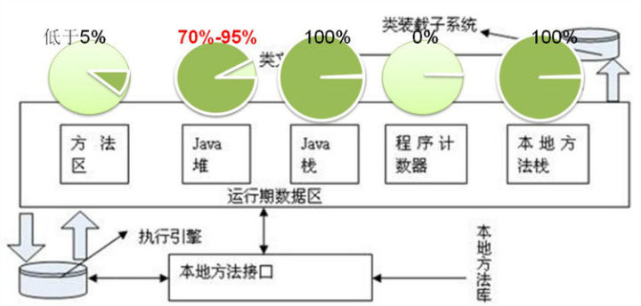
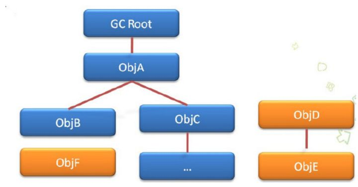

# JVM 垃圾回收及调优

[TOC]

## **在JVM的哪块内存中发生垃圾回收？**

JVM 的内存分区

1.程序计数器：当前线程所执行的字节码的行号指示器，控制着程序的分支、循环、跳转、异常处理。是线程私有的。

2.虚拟机栈：为每个方法在执行时创建一个栈帧，用于存储局部变量表、操作数栈栈等。其中局部变量表存储基本数据类型和**对象引用**。是线程私有的。

3.JAVA堆：所有**对象实例**都在堆上分配。所有线程共享此块内存。

4.方法区：所有线程共享的内存区域，用于存储虚拟机加载的类信息、常量、静态变量等。

由于垃圾回收是回收和对象有关的东西，所以主要发生在虚拟机栈和堆中；少部分发生在方法区。

下图更详细的说明了垃圾回收发生的位置：



本地方法栈与虚拟机栈相似，经常在一些虚拟机实现中被合并起来。

## **哪些对象需要被回收？**

不用的对象需要被回收，判断对象是否可用的方法：

### 引用计数法

给一个对象添加一个引用计数器，初始值为零，有一个地方引用它时，计数器加一，当一个引用失效时，计数器减一。计数器为零时此对象不可用。

引用计数法有一个致命的缺陷，就是当两个对象相互引用时，这两个对象实际是不可获得的，但是由于引用计数不为零，所以均不会被回收。

### 可达性分析法

算法的思路是通过一系列称为GC Roots的对象作为起始点，从这些节点向下搜索，当一个对象到GC Roots时没有任何引用链相连，证明此对象是不可用的。如下图，从GC Root不能到达ObjD ObjF ObjE，所以这三个对象是不可用的。



可做GC Roots的对象有 虚拟机栈中引用的对象（本地变量表）、方法区中静态属性引用的对象、方法区中常量引用的对象、本地方法栈中引用的对象（Native对象）。

### JVM中的四种引用

+ 强引用：程序中普遍存在的一种引用 Object o = new Object();垃圾收集器永远不会回收被强引用的对象。
+ 软引用：如下所示，当我们存在有用但不是必需的对象时，例如缓存，就可以使用软引用。

只要内存空间足够，软引用对象就不会被回收，将要发生内存溢出异常时，会将软引用的对象回收。

```java
SoftReference<String> sr = new SoftReference<String>(new String("hello"));
```

+ 弱引用：弱引用也是用来描述非必需对象的，当JVM进行垃圾回收时，无论内存是否充足，都会回收被弱引用关联的对象。

```java
WeakReference<String> sr = new WeakReference<String>(new String("hello"));
```


+ 虚引用：虚引用和前面的软引用、弱引用不同，它并不影响对象的生命周期。在java中用java.lang.ref.PhantomReference类表示。如果一个对象与虚引用关联，则跟没有引用与之关联一样，在任何时候都可能被垃圾回收器回收。

要注意的是，虚引用必须和引用队列关联使用，当垃圾回收器准备回收一个对象时，如果发现它还有虚引用，就会把这个虚引用加入到与之 关联的引用队列中。程序可以通过判断引用队列中是否已经加入了虚引用，来了解被引用的对象是否将要被垃圾回收。如果程序发现某个虚引用已经被加入到引用队列，那么就可以在所引用的对象的内存被回收之前采取必要的行动。

```java
ReferenceQueue<String> queue = new ReferenceQueue<String>();
PhantomReference<String> pr = new PhantomReference<String>(new String("hello"), queue);
```

## Major GC和Full GC的区别是什么？触发条件呢？

GC又分为minor GC 和 Full Gc(也称为Major GC)。Java 堆内存分为新生代和老年代，新生代中又分为1个Eden区域 和两个 Survivor区域。

那么对于 Minor GC 的触发条件： **大多数情况下，直接在 Eden 区中进行分配 **。如果 Eden区域没有足够的空间，那么就会发起一次 Minor GC；对于 Full GC（Major GC）的触发条件：也是如果老年代没有足够空间的话，那么就会进行一次 Full GC。

**实际上，需要考虑一个空间分配担保的问题 **：

在发生Minor GC之前，虚拟机会先检查老年代最大可用的连续空间是否大于新生代所有对象的总空间。如果大于则进行Minor GC，如果小于则看HandlePromotionFailure设置是否允许担保失败（不允许则直接Full GC）。如果允许，那么会继续检查老年代最大可用的连续空间是否大于历次晋升到老年代对象的平均大小，如果大于则尝试Minor GC（如果尝试失败也会触发Full GC），如果小于则进行Full GC。

> HotSpot VM垃圾回收详细解释

- Partial GC：并不收集整个GC堆的模式

- - Young GC：只收集young gen的GC
  - Old GC：只收集old gen的GC。只有CMS的concurrent collection是这个模式
  - Mixed GC：收集整个young gen以及部分old gen的GC。只有G1有这个模式

- Full GC：收集整个堆，包括young gen、old gen、perm gen（如果存在的话）等所有部分的模式。

Major GC通常是跟full GC是等价的，收集整个GC堆。但因为HotSpot VM发展了这么多年，外界对各种名词的解读已经完全混乱了，当有人说“major GC”的时候一定要问清楚他想要指的是上面的full GC还是old GC。

- young GC：当young gen中的eden区分配满的时候触发。注意young GC中有部分存活对象会晋升到old gen，所以young GC后old gen的占用量通常会有所升高。
- full GC：当准备要触发一次young GC时，如果发现统计数据说之前young GC的平均晋升大小比目前old gen剩余的空间大，则不会触发young GC而是转为触发full GC（因为HotSpot VM的GC里，除了CMS的concurrent collection之外，其它能收集old gen的GC都会同时收集整个GC堆，包括young gen，所以不需要事先触发一次单独的young GC）；或者，如果有perm gen的话，要在perm gen分配空间但已经没有足够空间时，也要触发一次full GC；或者System.gc()、heap dump带GC，默认也是触发full GC。

HotSpot VM里其它非并发GC的触发条件复杂一些，不过大致的原理与上面说的其实一样。
当然也总有例外。Parallel Scavenge（-XX:+UseParallelGC）框架下，默认是在要触发full GC前先执行一次young GC，并且两次GC之间能让应用程序稍微运行一小下，以期降低full GC的暂停时间（因为young GC会尽量清理了young gen的死对象，减少了full GC的工作量）。控制这个行为的VM参数是-XX:+ScavengeBeforeFullGC。

并发GC的触发条件就不太一样。以CMS GC为例，它主要是定时去检查old gen的使用量，当使用量超过了触发比例就会启动一次CMS GC，对old gen做并发收集。

## **怎样进行垃圾回收？**

+ 标记-清除算法：先标记出需要被回收的对象，然后全部清除.

这种算法有两个严重的问题，**一是标记清楚的效率不高，二是产生内存碎片**。

+ 复制算法:将内存划分为相等的两块区域A和B，一次只用其中一块A，当需要垃圾回收时，将A中所有存活的对象复制到B，然后清楚A，使用B。就这样周而复始。

但是也有一个明显的问题：**可使用的内存大小只有一半。**

+ 标记整理算法:先标记，然后让所有存活对象向另一端移动，然后直接清理端边界以外的内存。
+ 分代收集法：

> 新生代
>
> 所有新对象创建发生在Eden区，Eden区满后触发新生代上的minor GC，将Eden区和非空闲Survivor区存活对象复制到另一个空闲的Survivor区中。
>
> 永远保证一个Survivor是空的，新生代minor GC就是在两个Survivor区之间相互复制存活对象，直到Survivor区满为止。
>
> 由于新生代大多数对象是**“朝生夕死”**的所以，对于新生代采用有两个很小的Survivor区、一个大的Eden区，使用复制算法的原理进行回收：一次使用一个Survivor区1和Eden区，生还的对象移入另一个保留区2，然后清空所有，周而复始。

> 老年代：
>
> Eden区满后触发minor GC将存活对象复制到Survivor区，Survivor区满后触发minor GC将存活对象复制到老年代。
>
> 经过新生代的两个Survivor之间多次复制，仍然存活下来的对象就是年龄相对比较老的，就可以放入到老年代了，随着时间推移，如果老年代也满了，将触发Full GC，针对整个堆（包括新生代、老年代）进行垃圾回收。
>
> 老年代大多数对象会长期存活，不适合复制算法，所以使用标记-整理算法。

## 参数调优 -Xms -Xmx -Xmn -Xss

Xms 是指设定程序启动时占用内存大小。一般来讲，大点，程序会启动的快一点，但是也可能会导致机器暂时间变慢。

Xmx 是指设定程序运行期间最大可占用的内存大小。如果程序运行需要占用更多的内存，超出了这个设置值，就会抛出OutOfMemory异常。此值可以设置与-Xmx相同，以避免每次垃圾回收完成后JVM重新分配内存。

Xss 是指设定每个线程的堆栈大小。这个就要依据你的程序，看一个线程大约需要占用多少内存，可能会有多少线程同时运行等。


### 堆大小的设置

JVM 中最大堆大小有三方面限制：相关操作系统的数据模型（32-bt还是64-bit）限制；系统的可用虚拟内存限制；系统的可用物理内存限制。32位系统下，一般限制在1.5G~2G；64为操作系统对内存无限制。我在Windows Server 2003 系统，3.5G物理内存，JDK5.0下测试，最大可设置为1478m。
**典型设置：**

```java
java -Xmx3550m -Xms3550m -Xmn2g -Xss128k
```

  -**Xmx3550m** ：设置JVM最大可用内存为3550M。

  **-Xms3550m** ：设置JVM促使内存为3550m。此值可以设置与-Xmx相同，以避免每次垃圾回收完成后JVM重新分配内存。
  **-Xmn2g** ：设置年轻代大小为2G。**整个堆大小=年轻代大小 + 年老代大小 + 持久代大小** 。持久代一般固定大小为64m，所以增大年轻代后，将会减小年老代大小。此值对系统性能影响较大，Sun官方推荐配置为整个堆的3/8。
  **-Xss128k** ：设置每个线程的堆栈大小。JDK5.0以后每个线程堆栈大小为1M，以前每个线程堆栈大小为256K。更具应用的线程所需内存大小进行调整。在相同物理内存下，减小这个值能生成更多的线程。但是操作系统对一个进程内的线程数还是有限制的，不能无限生成，经验值在3000~5000左右。

```java
java -Xmx3550m -Xms3550m -Xss128k -XX:NewRatio=4 -XX:SurvivorRatio=4 -XX:MaxPermSize=16m -XX:MaxTenuringThreshold=0
```
 **-XX:NewRatio=4** :设置年轻代（包括Eden和两个Survivor区）与年老代的比值（除去持久代）。设置为4，则年轻代与年老代所占比值为1：4，年轻代占整个堆栈的1/5
  **-XX:SurvivorRatio=4** ：设置年轻代中Eden区与Survivor区的大小比值。设置为4，则两个Survivor区与一个Eden区的比值为2:4，一个Survivor区占整个年轻代的1/6
  **-XX:MaxPermSize=16m** :设置持久代大小为16m。
  **-XX:MaxTenuringThreshold=0** ：设置垃圾最大年龄。**如果设置为0的话，则年轻代对象不经过Survivor区，直接进入年老代** 。对于年老代比较多的应用，可以提高效率。**如果将此值设置为一个较大值，则年轻代对象会在Survivor区进行多次复制，这样可以增加对象再年轻代的存活时间** ，增加在年轻代即被回收的概率。


### 回收器选择

JVM给了三种选择：**串行收集器、并行收集器、并发收集器** ，但是串行收集器只适用于小数据量的情况，所以这里的选择主要针对并行收集器和并发收集器。默认情况下，JDK5.0以前都是使用串行收集器，如果想使用其他收集器需要在启动时加入相应参数。JDK5.0以后，JVM会根据当前[系统配置](http://java.sun.com/j2se/1.5.0/docs/guide/vm/server-class.html) 进行判断。

**吞吐量优先** 的并行收集器
如上文所述，并行收集器主要以到达一定的吞吐量为目标，适用于科学技术和后台处理等。

```java
java -Xmx3800m -Xms3800m -Xmn2g -Xss128k -XX:+UseParallelGC -XX:ParallelGCThreads=20 -XX:+UseParallelOldGC -XX:MaxGCPauseMillis=100 -XX:+UseAdaptiveSizePolicy
```

**-XX:+UseParallelGC** ：选择垃圾收集器为并行收集器。 **此配置仅对年轻代有效。即上述配置下，年轻代使用并发收集，而年老代仍旧使用串行收集。**

**-XX:ParallelGCThreads=20** ：配置并行收集器的线程数，即：同时多少个线程一起进行垃圾回收。此值最好配置与处理器数目相等。

**-XX:+UseParallelOldGC** ：配置年老代垃圾收集方式为并行收集。

**-XX:MaxGCPauseMillis=100 :** 设置每次年轻代垃圾回收的最长时间，如果无法满足此时间，JVM会自动调整年轻代大小，以满足此值。

**-XX:+UseAdaptiveSizePolicy** ：设置此选项后，并行收集器会自动选择年轻代区大小和相应的Survivor区比例，以达到目标系统规定的最低相应时间或者收集频率等，此值建议使用并行收集器时，一直打开。

**响应时间优先** 的并发收集器

如上文所述，并发收集器主要是保证系统的响应时间，减少垃圾收集时的停顿时间。

```java
java -Xmx3550m -Xms3550m -Xmn2g -Xss128k -XX:ParallelGCThreads=20 -XX:+UseConcMarkSweepGC -XX:+UseParNewGC XX:CMSFullGCsBeforeCompaction=5 -XX:+UseCMSCompactAtFullCollection
```

**-XX:+UseConcMarkSweepGC** ：设置年老代为并发收集。测试中配置这个以后，-XX:NewRatio=4的配置失效了，原因不明。所以，此时年轻代大小最好用-Xmn设置。

**-XX:+UseParNewGC** :设置年轻代为并行收集。可与CMS收集同时使用。JDK5.0以上，JVM会根据系统配置自行设置，所以无需再设置此值。

**-XX:CMSFullGCsBeforeCompaction** ：由于并发收集器不对内存空间进行压缩、整理，所以运行一段时间以后会产生“碎片”，使得运行效率降低。此值设置运行多少次GC以后对内存空间进行压缩、整理。
**-XX:+UseCMSCompactAtFullCollection** ：打开对年老代的压缩。可能会影响性能，但是可以消除碎片

### 常用配置

1. 堆设置
   - **-Xms** :初始堆大小
   - **-Xmx** :最大堆大小
   - **-XX:NewSize=n** :设置年轻代大小
   - **-XX:NewRatio=n:** 设置年轻代和年老代的比值。如:为3，表示年轻代与年老代比值为1：3，年轻代占整个年轻代年老代和的1/4
   - **-XX:SurvivorRatio=n** :年轻代中Eden区与两个Survivor区的比值。注意Survivor区有两个。如：3，表示Eden：Survivor=3：2，一个Survivor区占整个年轻代的1/5
   - **-XX:MaxPermSize=n** :设置持久代大小
2. 收集器设置
   - **-XX:+UseSerialGC** :设置串行收集器
   - **-XX:+UseParallelGC** :设置并行收集器
   - **-XX:+UseParalledlOldGC** :设置并行年老代收集器
   - **-XX:+UseConcMarkSweepGC** :设置并发收集器
3. 垃圾回收统计信息
   - **-XX:+PrintGC**
   - **-XX:+PrintGCDetails**
   - **-XX:+PrintGCTimeStamps**
   - **-Xloggc:filename**
4. 并行收集器设置
   - **-XX:ParallelGCThreads=n** :设置并行收集器收集时使用的CPU数。并行收集线程数。
   - **-XX:MaxGCPauseMillis=n** :设置并行收集最大暂停时间
   - **-XX:GCTimeRatio=n** :设置垃圾回收时间占程序运行时间的百分比。公式为1/(1+n)
5. 并发收集器设置
   - **-XX:+CMSIncrementalMode** :设置为增量模式。适用于单CPU情况。
   - **-XX:ParallelGCThreads=n** :设置并发收集器年轻代收集方式为并行收集时，使用的CPU数。并行收集线程数。

### 调优总结

1. 年轻代大小选择

   - **响应时间优先的应用** ：**尽可能设大，直到接近系统的最低响应时间限制** （根据实际情况选择）。在此种情况下，年轻代收集发生的频率也是最小的。同时，减少到达年老代的对象。
   - **吞吐量优先的应用** ：尽可能的设置大，可能到达Gbit的程度。因为对响应时间没有要求，垃圾收集可以并行进行，一般适合8CPU以上的应用。

2. 年老代大小选择

   - 响应时间优先的应用

      ：年老代使用并发收集器，所以其大小需要小心设置，一般要考虑并发会话率和会话持续时间

      等一些参数。如果堆设置小了，可以会造成内存碎片、高回收频率以及应用暂停而使用传统的标记清除方式；如果堆大了，则需要较长的收集时间。最优化的方案，一般需要参考以下数据获得：

     - 并发垃圾收集信息
     - 持久代并发收集次数
     - 传统GC信息
     - 花在年轻代和年老代回收上的时间比例

     减少年轻代和年老代花费的时间，一般会提高应用的效率

   - **吞吐量优先的应用** ：一般吞吐量优先的应用都有一个很大的年轻代和一个较小的年老代。原因是，这样可以尽可能回收掉大部分短期对象，减少中期的对象，而年老代尽存放长期存活对象。

3. 较小堆引起的碎片问题

   因为年老代的并发收集器使用标记、清除算法，所以不会对堆进行压缩。当收集器回收时，他会把相邻的空间进行合并，这样可以分配给较大的对象。但是，当堆空间较小时，运行一段时间以后，就会出现“碎片”，如果并发收集器找不到足够的空间，那么并发收集器将会停止，然后使用传统的标记、清除方式进行回收。如果出现“碎片”，可能需要进行如下配置：

   - **-XX:+UseCMSCompactAtFullCollection** ：使用并发收集器时，开启对年老代的压缩。
   - **-XX:CMSFullGCsBeforeCompaction=0** ：上面配置开启的情况下，这里设置多少次Full GC后，对年老代进行压缩