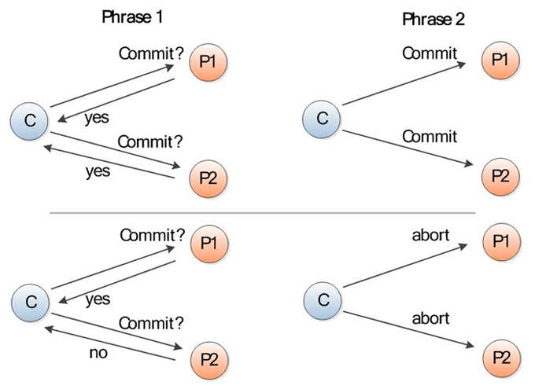
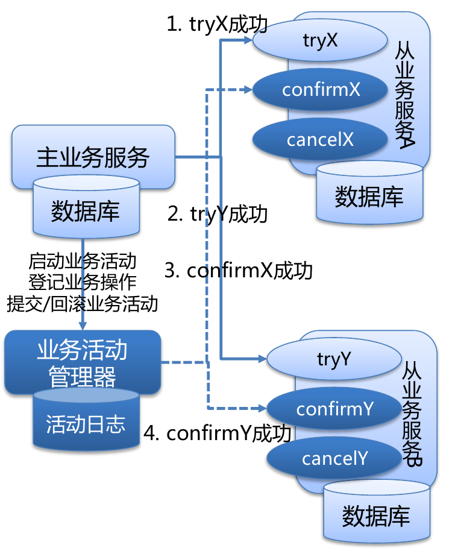

# 微服务–分布式事务的实现方法及替代方案

## 概念

- **事务补偿机制**: 在事务链中的任何一个正向事务操作, 都必须存在一个完全符合回滚规则的可逆事务.
- **CAP理论**: CAP(Consistency, Availability, Partition Tolerance), 阐述了一个分布式系统的三个主要方面, 只能同时择其二进行实现. 常见的有CP系统, AP系统
- **幂等性**: 简单的说, **业务操作支持重试**, 不会产生不利影响. 常见的实现方式: 为消息额外增加唯一ID.
- **BASE**(Basically avaliable, soft state, eventually consistent): 是分布式事务实现的一种理论标准.

> CAP:
>
> Consistency(一致性), 数据一致更新，所有数据变动都是同步的
>
> Availability(可用性), 好的响应性能
>
> Partition tolerance(分区容忍性) 可靠性
>
> 定理：任何分布式系统只可同时满足二点，没法三者兼顾。
>
>  关系数据库的ACID模型拥有 高一致性 + 可用性 很难进行分区：
>
> Atomicity原子性：一个事务中所有操作都必须全部完成，要么全部不完成。
>
> Consistency一致性. 在事务开始或结束时，数据库应该在一致状态。
>
> Isolation隔离层. 事务将假定只有它自己在操作数据库，彼此不知晓。
>
> Durability. 一旦事务完成，就不能返回。
>
> BASE模型反ACID模型，完全不同ACID模型，牺牲高一致性，获得可用性或可靠性。
>
> Basically Available基本可用。支持分区失败(e.g. sharding碎片划分数据库)
>
> Soft state软状态 状态可以有一段时间不同步，异步。
>
> Eventually consistent最终一致，最终数据是一致的就可以了，而不是时时高一致。
>
> BASE思想的主要实现有1.按功能划分数据库 2.sharding碎片 

## 柔性事务与刚性事务

刚性事务是指严格遵循ACID原则的事务, 例如单机环境下的数据库事务.

柔性事务是指遵循BASE理论的事务, 通常用在分布式环境中, 常见的实现方式有: 两阶段提交(2PC), TCC补偿型提交, 基于消息的异步确保型, 最大努力通知型.

通常对本地事务采用刚性事务, 分布式事务使用柔性事务.

## 最佳实践

- 如果业务场景需要强一致性, 那么尽量避免将它们放在不同服务中, 也就是尽量使用本地事务, 避免使用强一致性的分布式事务.
- 如果业务场景能够接受最终一致性, 那么最好是使用基于消息的最终一致性的方案(异步确保型)来解决.
- 如果业务场景需要强一致性, 并且**只能够进行分布式服务部署**, 那么最好是使用TCC方案而不是2PC方案来解决.

注意: 以下每种方案都有不同的适用场合, 需要根据实际业务场景来选择.

## 两阶段提交（2PC）

两阶段提交(Two Phase Commit, 2PC), 具有强一致性, 是CP系统的一种典型实现.

两阶段提交, 常见的标准是XA, JTA等. 例如Oracle的数据库支持XA.

下图是两阶段提交的示意图:

图的上半是两阶段提交成功的演示, 下半是两阶段提交失败的演示. 

###什么是分布式事务—两阶段提交协议 ？ 

两阶段提交协议（Two-phase Commit，2PC）经常被用来实现分布式事务。一般分为协调器和若干事务执行者两种角色，这里的事务执行者就是具体的数据库，抽象点可以说是可以控制给数据库的程序。 协调器可以和事务执行器在一台机器上。

在分布式系统中，每个节点虽然可以知晓自己的操作时成功或者失败，却无法知道其他节点的操作的成功或失败。当一个事务跨越多个节点时，为了保持事务的ACID特性，需要引入一个作为协调者的组件来统一掌控所有节点(称作参与者)。

### 缺点

- 两阶段提交中的第二阶段, 协调者需要等待所有参与者发出yes请求, 或者一个参与者发出no请求后, 才能执行提交或者中断操作. 这会造成**长时间同时锁住多个资源, 造成性能瓶颈**, 如果参与者有一个耗时长的操作, 性能损耗会更明显.
- 实现复杂, 不利于系统的扩展, 不推荐.

## TCC (Try-Confirm-Cancle)

TCC, 是基于补偿型事务的AP系统的一种实现, 具有最终一致性.

下面以**客户购买商品时的付款操作**为例进行讲解:

- Try: 
  完成所有的业务检查(一致性),预留必须业务资源(准隔离性); 
  体现在本例中, 就是确认客户账户余额足够支付(一致性), 锁住客户账户, 商户账户(准隔离性).
- Confirm: 
  使用Try阶段预留的业务资源执行业务(业务操作必须是幂等的), 如果执行出现异常, 要进行重试. 
  在这里就是执行客户账户扣款, 商户账户入账操作.
- Cancle: 
  释放Try阶段预留的业务资源, 在这里就是释放客户账户和商户账户的锁; 
  如果任一子业务在Confirm阶段有操作无法执行成功, 会造成对业务活动管理器的响应超时, 此时要对其他业务执行补偿性事务. 如果补偿操作执行也出现异常, 必须进行重试, 若实在无法执行成功, 则事务管理器必须能够感知到失败的操作, 进行log(用于事后人工进行补偿性事务操作或者交由中间件接管在之后进行补偿性事务操作).

### 优点

对比与前面提到的两阶段提交法, 有两大优势:

- TCC能够对分布式事务中的**各个资源进行分别锁定, 分别提交与释放,** 例如, 假设有AB两个操作, 假设A操作耗时短, 那么A就能较快的完成自身的try-confirm-cancel流程, 释放资源. 无需等待B操作. 如果事后出现问题, 追加执行补偿性事务即可.
- **TCC是绑定在各个子业务上的**(除了cancle中的全局回滚操作), 也就是各服务之间可以在一定程度上”异步并行”执行.

### 注意事项

- 事务管理器(协调器)这个节点必须以带同步复制语义的高可用集群(HAC)方式部署.
- 事务管理器(协调器)还需要使用多数派算法来避免集群发生脑裂问题.

### 适用场景

- 严格一致性
- 执行时间短
- 实时性要求高

## 异步确保型

> 通过将一系列同步的事务操作变为**基于消息执行的异步操作**, 避免了分布式事务中的同步阻塞操作的影响.

这个方案真正实现了两个服务的解耦, 解耦的关键就是**异步消息**和补偿性事务.

执行步骤如下:

1. MQ发送方发送远程事务消息到MQ Server;
2. MQ Server给予响应, 表明事务消息已成功到达MQ Server.
3. MQ发送方Commit本地事务.
4. 若本地事务Commit成功, 则通知MQ Server允许对应事务消息被消费; 若本地事务失败, 则通知MQ Server对应事务消息应被丢弃.
5. 若MQ发送方超时未对MQ Server作出本地事务执行状态的反馈, 那么需要MQ Servfer向MQ发送方主动回查事务状态, 以决定事务消息是否能被消费.
6. 当得知本地事务执行成功时, MQ Server允许MQ订阅方消费本条事务消息.

需要额外说明的一点, 就是事务消息投递到MQ订阅方后, 并不一定能够成功执行. 需要MQ订阅方主动给予消费反馈(ack)

- 如果MQ订阅方执行远程事务成功, 则给予消费成功的ack, 那么MQ Server可以安全将事务消息移除;
- 如果执行失败, MQ Server需要对消息重新投递, 直至消费成功.

### 注意事项

- 消息中间件在系统中扮演一个重要的角色, 所有的事务消息都需要通过它来传达, 所以消息中间件也需要支持 HAC 来确保事务消息不丢失.
- 根据业务逻辑的具体实现不同，还可能需要对消息中间件增加消息不重复, 不乱序等其它要求.

### 适用场景

- 执行周期较长
- 实时性要求不高

## 最大努力通知型

这是分布式事务中要求最低的一种, 也可以通过消息中间件实现, 与前面异步确保型操作不同的一点是, 在消息由MQ Server投递到消费者之后, **允许在达到最大重试次数之后正常结束事务**.

### 适用场景

交易结果消息的通知等