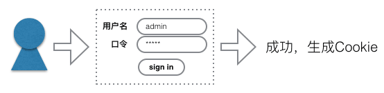
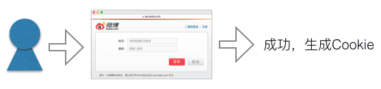

# 设计一个可扩展的用户登录系统

[TOC]

## 表设计

在Web系统中，用户登录是最基本的功能。要实现用户名+密码登录，很多同学的第一想法就是直接创建一个Users表，包含username和password两列，这样，就可以实现登录了：

|  id  | username | password | name等其他字段 |
| :--: | :------: | :------: | :-------: |
|  A1  |   bob    | a1b23f2c |    ...    |
|  A2  |   adam   | c0932f32 |    ...    |


现在问题来了，如果要让用户通过第三方登录，比如微博登录或QQ登录，怎么集成进来呢？

以微博登录为例，由于微博使用OAuth2协议登录，所以，一个登录用户会包含他的微博身份的ID，一个Access Token用于代表该用户访问微博的API和一个过期时间。

要集成微博登录，很多童鞋立刻想到把Users表扩展几列，记录下微博的信息：


|  id  | username | password | weibo_id | weibo_access_token | weibo_expires | name等其他字段 |
| :--: | :------: | :------: | :------: | :----------------: | :-----------: | :-------: |
|  A1  |   bob    | a1b23f2c | W-012345 |     xxxxxxxxxx     |    604800     |    ...    |
|  A2  |   adam   | c0932f32 | W-012345 |     xxxxxxxxxx     |    604800     |    ...    |

加一个QQ登录Users表就又需要加3列，如果这么扩展下去，改表都得累死，不要说维护代码了。

那怎么才能设计出灵活的登录呢？

不妨换个角度考虑用户登录。当用户以任意一种方式登录成功后，我们读取到的总是Users表对应的一行记录，它实际上是用户的个人资料（Profile），而登录过程只是为了认证用户（Authenticate），无论是本地用密码验证，还是委托第三方登录，这个过程本质上都是认证。

所以，如果把Profile和Authenticate分开，就十分容易理解了。Users表本身只存储用户的Profile：

| id   | name | birth等其他字段 |
| ---- | ---- | ---------- |
| A1   | Bob  | ...        |
| A2   | Adam | ...        |

而通过用户名口令登录可视为一种Authenticate的方式，利用LocalAuth表维护：

| id   | user_id | username | password |
| ---- | ------- | -------- | -------- |
| 01   | A1      | bob      | a1b23f2c |
| 02   | A2      | adam     | c0932f32 |

通过微博登录可视为另一种Authenticate方式，利用OAuth表维护：

| id   | user_id | weibo_id | weibo_access_token | weibo_expires |
| ---- | ------- | -------- | ------------------ | ------------- |
| 11   | A1      | W-012345 | xxxxxxxxxx         | 604800        |
| 12   | A2      | W-234567 | xxxxxxxxxx         | 604800        |

如果要添加另一种OAuth登录，比如QQ登录，增加一个表就可以了。不过既然大家都是OAuth家族的，不如统一到一个表，给每家起个名字区分就好了：

| id   | user_id | oauth_name | oauth_id | oauth_access_token | oauth_expires |
| ---- | ------- | ---------- | -------- | ------------------ | ------------- |
| 11   | A1      | weibo      | W-012345 | xxxxxxxxxx         | 604800        |
| 12   | A2      | weibo      | W-234567 | xxxxxxxxxx         | 604800        |
| 13   | A1      | qq         | Q-090807 | xxx-xxx-xxx        | 86400         |
| 14   | A2      | qq         | Q-807060 | xxx-xxx-xxx        | 86400         |

如果要增加一种新的登录方式，比如SAML，那就再加一种类型的表。

有些网站需要API访问，API可以使用api_key和api_secret来认证，可是怎么把一个API访问关联到一个用户？方法还是增加一种API Auth的表：

| id   | user_id | api_key  | api_secret |
| ---- | ------- | -------- | ---------- |
| 11   | A1      | a-012345 | xxxxxxxxxx |
| 12   | A2      | a-234567 | xxxxxxxxxx |

每一种X-Auth表都存储了用户的登录认证信息，并通过user_id关联到Users表。这样一来，不但登录过程简化了，而且一个用户可以使用多种方式登录。只要登录成功，拿到了user_id，最后读取Users表是为了获得用户的Profile，这样读出来的数据也更安全，因为Users表不包含用户口令，不会因为暴露API而不小心把口令给泄露出去。

设计可扩展的数据库表的结构，基本思想是：

+ Users表只存储User的Profile信息，没有任何认证信息（例如，不存Password）；
+ 每一种登录方式对应一个XxxAuth表，该表存储对应的认证信息，以及一个userId字段用于关联到某个User。

## 认证代码

现在的问题是，在Web系统中，由于HTTP请求本质上是无状态的，每个已认证用户的信息都必须通过Cookie来传递。

不对啊，我们无论用ASP、PHP还是JSP，打开服务器的session就可以识别用户了啊！

> 少年，服务器的session也无非是靠一个特殊名称的Cookie来识别而已，只不过由服务器本身帮你完成了解析Cookie、在session中查找User的过程，而代价却是内存占用高，单台服务器变成有状态，无法简单扩展成集群。遇到不懂事的年轻人，什么都敢往session里扔，很快就把服务器搞死了。

所以，除了演示程序外，我们从不用服务器提供的session。

如果仔细思考用户的登录过程，又可以发现，其实不同的登录方式实现起来复杂度也是不同的

1. 用户名 + 口令

当用户需要以用户名＋口令来登录时，我们会让用户填写一个登录表单，如果验证通过，就给用户生成一个可靠的Cookie来标识这个用户：



如果用户继续访问其他页面，我们就需要利用这个Cookie来识别用户。

2. 通过第三方网站登录

当用户需要以第三方OAuth登录时，我们会让用户重定向到第三方登录页，例如微博登录页，如果用户在第三方登录成功，第三方会再把用户重定向回我们的网站，并附上一个code表示是否验证通过。如果验证通过，我们还需要给用户生成一个可靠的Cookie来标识这个用户：



+ 通过HTTP Authorization Header登录

这种方式通常不是用户自己发起的请求，而是由代表用户的机器发起的请求。因为每个页面都会附上Authorization: Basic XXXXX这个Header，所以每个页面都需要验证。

+ 通过X-API-Token登录

这种方式和上一种情况类似，也是由代表用户的机器发起的请求，不同的是用X-API-Token代替了Authorization Header，更安全可靠。同上，每个页面都需要验证。

## 如何认证

现在问题来了，这么多类型的认证，怎么才能把代码写得能看明白？

复杂的问题都要分解成几步。我们先看通过用户名＋口令的表单登录。

在这种条件下，用户首先要被导向到一个登录URL，例如，/signin，然后填写用户名和口令。具体验证方式就是利用Users表和LocalAuth表，如果验证成功，我们就创建一个可信的Cookie给用户。

通过第三方网站登录也是类似的，要先把用户导向到登录URL，登录成功后，创建一个可信的Cookie。

剩下的问题就只有一个：用户每访问一个普通页面，如何确认用户身份？

确认用户身份，我们需要一个统一的Authenticator接口。以Java为例，该接口看起来如下：

```java
public interface Authenticator {
    // 认证成功返回User，认证失败抛出异常，无认证信息返回null:
    User authenticate(HttpServletRequest request, HttpServletResponse response) throws AuthenticateException;
}
```

接下来，对于每一种类型的认证，我们都编写一个对应的Authenticator的实现类。例如，针对表单登录后的Cookie，需要一个LocalCookieAuthenticator：

```java
public LocalCookieAuthenticator implements Authenticator {
    public User authenticate(HttpServletRequest request, HttpServletResponse response) {
        String cookie = getCookieFromRequest(request, 'cookieName');
        if (cookie == null) {
            return null;
        }
        return getUserByCookie(cookie);
    }
}
```

对于直接用Basic认证的Authorization Header，我们需要一个BasicAuthenticator：

```java
public BasicAuthenticator implements Authenticator {
    public User authenticate(HttpServletRequest request, HttpServletResponse response) {
        String auth = getHeaderFromRequest(request, "Authorization");
        if (auth == null) {
            return null;
        }
        String username = parseUsernameFromAuthorizationHeader(auth);
        String password = parsePasswordFromAuthorizationHeader(auth);
        return authenticateUserByPassword(username, password);
    }
}
```

对于用API Token认证的方式，同样编写一个APIAuthenticator：

```java
public APIAuthenticator implements Authenticator {
    public User authenticate(HttpServletRequest request, HttpServletResponse response) {
        String token = getHeaderFromRequest(request, "X-API-Token");
        if (token == null) {
            return null;
        }
        return authenticateUserByAPIToken(token);
    }
}
```

然后在一个统一的入口处，例如Filter里面，把这些Authenticator全部串起来，让它们依次自己去尝试认证：

```java
public class GlobalFilter implements Filter {
    // 所有的Authenticator都在这里:
    Authenticator[] authenticators = initAuthenticators();

    // 每个页面都会执行的代码:
    public void doFilter(ServletRequest request, ServletResponse response, FilterChain chain) {
        User user = null;
        for (Authenticator auth : this.authenticators) {
            user = auth.authenticate(request, response);
            if (user != null) {
                break;
            }
        }
        // user放哪？
        chain.doFilter(request, response);
    }
}
```

现在，一个可扩展的认证体系在Web层就基本搭建完成了，我们可以随意组合各种Authenticator，优先级高的放前面。一旦某个Authenticator成功地认证了用户，后面的Authenticator就不执行了。

最后只剩一个问题：认证成功后的User对象放哪？

放session里？NO，我们在前面已经拒绝了使用服务器提供的session。放request里？也不好，因为HTTP级别的对象太低级，很难传到业务层里。

> 那你说应该放哪？

当然是放到一个与业务逻辑相关的地方了，比如UserContext中。把Filter代码改写如下：

```java
public class GlobalFilter implements Filter {
    Authenticator[] authenticators = initAuthenticators();

    public void doFilter(ServletRequest request, ServletResponse response, FilterChain chain) {
        // 链式认证获得User:
        User user = tryGetAuthenticatedUser(request, response);
        // 把User绑定到UserContext中:
        try (UserContext ctx = new UserContext(user)) {
            chain.doFilter(request, response);
        }
    }
}
```

这样一来，任何地方需要获得当前User时，只需要写：

```java
User user = UserContext.getCurrentUser();
```

最后总结一下我们编写认证逻辑的思路：

1. 每一种认证方式都是一种Authenticator的实现；
2. 把所有认证方式串起来，在一个统一的Filter入口来认证；
3. 认证后的User对象用UserContext存储，并提供一个简单的方法返回当前User。

好处如下：

1. 认证方式可简单扩展；
2. 认证逻辑统一在一处。

还有一个最大的好处，就是业务相关的代码根本就不需要依赖底层HTTP对象，比如session和request，它们只依赖UserContext，这才是真正的解耦，并且非常容易测试业务逻辑，因为不再需要模拟session和request。

赶快按照上述思想，把上面的认证代码调通后，细心的同学才能发现，本文还遗留了几个小问题：

1. 表单和OAuth认证成功后，如何生成“可信”的Cookie？
2. 如何根据“可信”的Cookie识别用户？
3. UserContext怎么编写？

## 如何生成一个可信的Cookie

因为Cookie都是服务器端创建的，所以，生成一个可信Cookie的关键在于，客户端无法伪造出Cookie。

用什么方法可以防止伪造？数学理论告诉我们，单向函数就可以防伪造。

例如，计算md5就是一个单向函数。假设写好了函数md5(String s)，根据输入可以很容易地计算结果：

```java
md5("hello") => "b1946ac92492d2347c6235b4d2611184"
```

但是，根据结果"b1946...11184"反推输入却非常困难。

利用单向函数，我们可以生成一个防伪造的Cookie。

例如，用户以用户名"admin"，口令"hello"登录成功后，要生成Cookie，我们就可以用md5计算：
```java
md5("hello") => "b1946ac92492d2347c6235b4d2611184"
```
然后，把md5值和用户名"admin"串起来构成一个Cookie发送给客户端：
```java
"admin:b1946ac92492d2347c6235b4d2611184"
```
当客户端把上面的Cookie发给服务器时，服务器如何验证该Cookie是有效的呢？可以按照以下步骤：

1. 服务器把Cookie分解成用户名"admin"和md5值"b1946...11184"；

2. 根据用户名"admin"从数据库中找到该用户的记录，并继续找到该用户的口令"hello"；

3. 服务器根据数据库中存储的口令计算md5("hello")并与客户端Cookie的md5值对比。

从理论到实践还差着一个工程的距离。上面的算法仅仅解决了基本的验证，在实际应用中，存在如下严重问题：

1. 简单的md5值很容易被彩虹表攻击，从而直接得到用户原始口令；
2. 用户名被暴露在Cookie中，如果用email作为用户名，用户的email就被泄露了；
3. Cookie没有设置有效期（注意浏览器发过来的Cookie不一定真是浏览器发的），导致一旦登录，永久有效；
4. 其他若干问题。

如何解决？方法是计算hash的时候，不仅只包含用户口令，还包含Cookie过期时间，以及其他相关随机数，这样计算的hash就非常安全。

举个栗子：

假设用户仍以用户名"admin"，口令"hello"登录成功，系统可以知道：

1. 该用户的id，例如，1230001；
2. 该用户的口令，例如，"hello"；
3. Cookie过期时间，可由当前时间戳＋固定时长计算，例如，1461288165；
4. 系统固定的一个随机字符串，例如，"secret"。

把上面4部分拼起来，得到：
```java
"1230001:hello:1461288165:secret"
```

计算上述字符串的md5，得到："d9753...004d5"。

最后，按照用户id，过期时间和最终的hash值，拼接得到Cookie如下：
```java
"1230001:1461288165:d9753...004d5"
```

当浏览器发送Cookie回服务器时，我们就可以按照下面的方式验证Cookie：

1. 把Cookie分割成三部分，得到用户id，过期时间和hash值；
2. 如果过期时间已到，直接丢弃；
3. 根据用户id查找用户，得到用户口令；
4. 按照生成Cookie时的算法计算md5，与Cookie自带的hash值对比。

如果用户自己对Cookie进行修改，无论改用户id、过期时间，还是hash值，都会导致最终计算结果不一致。

即使用户知道自己的id和口令，也知道服务器的生成算法，他也无法自己构造出有效的Cookie，原因就在于计算hash时的“系统固定的随机字符串”他不知道。

这个“系统固定的随机字符串”还有一个用途，就是编写代码的开发人员不知道生产环境服务器配置的随机字符串，他也无法伪造Cookie。

md5算法还可以换成更安全的sha1/sha256。

现在我们就解决了如何生成一个可信Cookie的问题。

如果用户通过第三方OAuth登录，服务器如何生成Cookie呢？

方法和上面一样，具体算法自己想去。

## 如何绑定用户

如果用户被认证了，系统实际上就认为从数据库读取的一个User对象是有效的当前用户，现在的问题是，如何让业务层代码获知当前用户。

方法一：每个业务方法新增一个User参数。

该方法太弱智，故不在此处讨论。

方法二：把User绑定到request中。

该方法太幼稚，导致编写业务的时候需要这么写：

```java
User user = (User) request.getAttribute("USER");
```
问题一大堆：

+ Key值"USER"需要定义到常量中，但不排除很多开发人员偷懒直接写死了，这样编译器根本检测不到错误；
+ 某个零经验的开发人员在某处放置了request.setAttribute("USER", true)的代码，导致后续操作直接崩溃；
+ request对象怎么拿？再写一个SpringHelper.getContext().getCurrentRequest()？
+ 强制转型看着就不爽。

正确做法：把User用ThreadLocal绑定到当前处理线程：

```java
public class UserContext {
    public static final ThreadLocal<User> current = new ThreadLocal<User>();
}
```

在统一的入口，例如Filter处理：
```java
public class MyFilter implements Filter {
    public void doFilter(ServletRequest request, ServletResponse response, FilterChain chain) {
        User user = tryGetAuthenticatedUser(request, response);
        UserContext.current.set(user);
        chain.doFilter(request, response);
        UserContext.current.remove(user);
    }
}
```
这样就可以在业务逻辑的任何地方获得当前User：
```java
User user = UserContext.current.get();
```
上述代码是零经验工程师写的，大家不要学。

有经验的工程师会指出，没有try...finally逻辑就不对，但这只是知道Java语法后的生搬硬套，也不对。

这段代码的真正问题是缺少封装，没有把实现细节隐藏起来。大家熟知的开闭原则“对扩展开放，对修改关闭”，说起来容易，实现起来困难。

让我们用开闭原则重写上面的代码：
```java
public class UserContext implements AutoCloseable {

    static final ThreadLocal<User> current = new ThreadLocal<User>();

    public UserContext(User user) {
        current.set(user);
    }

    public static User getCurrentUser() {
        return current.get();
    }

    public void close() {
        current.remove();
    }
}
```
是不是简单多了？

> 代码量大了，难道还更简单了？

是的，简单与否不看代码量本身，而是看调用起来是不是简单。在Filter中调用起来就非常简单：
```java
public class MyFilter implements Filter {
    public void doFilter(ServletRequest request, ServletResponse response, FilterChain chain) {
        User user = tryGetAuthenticatedUser(request, response);
        try (UserContext context = new UserContext(user)) {
            chain.doFilter(request, response);
        }
    }
}
```
finally哪去了？与时俱进是我们的原则之一，搜索一下AutoCloseable吧！

在业务逻辑中调用更简单：
```java
User user = UserContext.getCurrentUser();
```
最后我们来演示一下很多场景需要的用法：

```java
try (UserContext context = new UserContext(user)) {
    // 当前用户是user：
    processProfile(UserContext.getCurrentUser());
    // 需要更高权限的admin才能执行的操作怎么办？
    // 方法是获取一个admin用户：
    try (UserContext context = new UserContext(getAdmin())) {
        // 现在的当前用户是admin：
        processAdminJob(UserContext.getCurrentUser());
    }
    // 现在当前用户又自动变回了普通user：
    processProfile(UserContext.getCurrentUser());
}
```
实现上述逻辑只需要对UserContext做一个简单的修改就可以实现了。

这才是真正的开闭啊！
