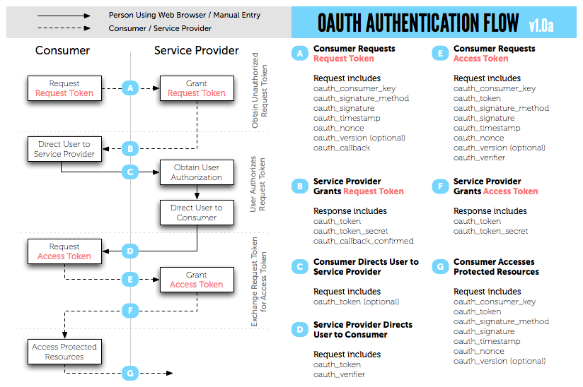
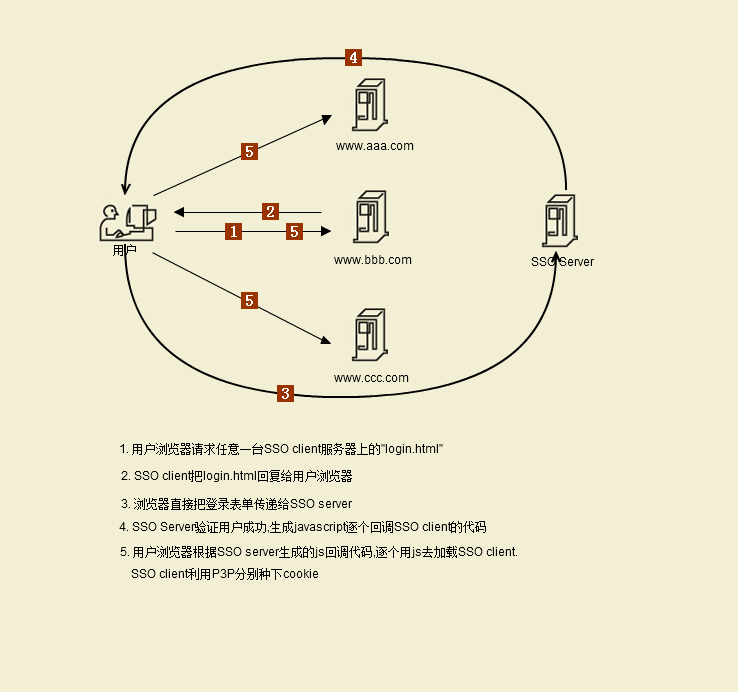

# Cookie + Session + OAuth + SSO

**HTTP协议**

HTTP虽然是基于TCP/IP，但是HTTP本身却是无状态协议。每次HTTP简单的请求和响应是独立事件，事件之间没有状态的联系。
而TCP/IP在实现的时候，需要两端维持一个协议状态机，并根据网络事件进行状态的跃迁。

## cookie & session
### Cookie

在BS开发中，Cookie和Session是很重要的两个概念。

Cookie 是一小段文本信息，伴随着用户请求和页面在 Web 服务器和浏览器之间传递。用户每次访问站点时，Web 应用程序都可以读取 Cookie 包含的信息。 Cookie 的基本工作原理如果用户再次访问站点上的页面，当该用户输入 URL www.abc.com 时，浏览器就会在本地硬盘上查找与该 URL 相关联的 Cookie。如果该 Cookie 存在，浏览器就将它与页面请求一起发送到您的站点。

Cookie中包含用户名和密码，再加上一些信息以后，进行MD5或其他加密方式加密后生成的字符串。

### Session

session是一种保存上下文信息的机制，它是针对每一个用户的，变量的值保存在服务器端，通过SessionID来区分不同的客户，session是以Cookie或URL重写为基础。默认使用Cookie来实现，系统会创造一个名为JSESSIONID的输出Cookie，或称为”Session Cookie”.

### Session的工作原理

就session的实现而言，好像是这样的

+ 当有Session启动时，服务器生成一个唯一值，称为SessionID（好像是通过取进程ID的方式取得的）。
+ 然后，服务器开辟一块内存，对应于该SessionID。
+ 服务器再将该SessionID写入浏览器的cookie(一些在网页的源代码中有所体现)。
+ 服务器内有一进程，监视所有Session的活动状况，如果有Session超时或是主动关闭，服务器就释放该内存块。
+ 当浏览器连入IIS(服务器)时并请求的ASP(脚本语言)内用到Session时，IIS(服务器)就读浏览器Cookie中的SessionID。
+ 然后，服务检查该SessionID所对应的内存是否有效。
+ 如果有效，就读出内存中的值。
+ 如果无效，就建立新的Session。

### Cookie和Session的安全性

相比起Cookie，session 是存储在服务器端的会话，相对安全，并且不像 Cookie 那样有存储长度限制。 由于 Session是以文本文件形式存储在服务器端的，所以不怕客户端修改 Session 内容。实际上在服务器端的 Session 文件，PHP 自动修改 session 文件的权限，只保留了系统读和写权限，而且不能通过 ftp 修改，所以安全得多。

对于 Cookie 来说，假设我们要验证用户是否登陆，就必须在 Cookie 中保存用户名和密码(可能是 md5 加密后字符串)，并在每次请求页面的时候进行验证。如果用户名和密码存储在数据库，每次都要执行一次数据库查询，给数据库造成多余的负担。因为我们并不能只做一次验证。为什么呢?因为客户端 Cookie 中的信息是有可能被修改的。假如你存储 $admin 变量来表示用户是否登陆，$admin 为 true 的时候表示登陆，为 false 的时候表示未登录，在第一次通过验证后将 $admin 等于 true 存储在 Cookie，下次就不用验证了，这样对么?错了，假如有人伪造一个值为 true 的 $admin 变量那不是就立即取的了管理权限么?非常的不安全。

而 Session 就不同了，Session 是存储在服务器端的，远程用户没办法修改 session 文件的内容，因此我们可以单纯存储一个 $admin 变量来判断是否登陆，首次验证通过后设置 $admin 值为 true，以后判断该值是否为 true，假如不是，转入登陆界面，这样就可以减少很多数据库操作了。而且可以减少每次为了验证 Cookie 而传递密码的不安全性了(session 验证只需要传递一次，假如你没有使用 SSL 安全协议的话)。即使密码进行了 md5 加密，也是很容易被截获的。

## OpenID

OpenID实际上不属于SSO, 只是一种身份的认证而已。解决的问题是你是谁。

OpenID挺NB的,拥有众多大腕粉丝, 例如GOOGLE、YAHOO、Facebook，希望别人的系统使用它们的帐号登陆。他们希望一种足够简单的WEB SSO规范，于是选择一种草根网络协议OpenID。OpenID，名字取得好，顾名思义，一看就知道它是干嘛的。国内也有它的Fans，例如豆瓣网。OpenID的确足够简单，但是协议本身是不完善，可能需要一些补充协议才能够满足业务需求。例如GOOGLE采用OpenID + OAuth。目前支持OpenID有Yahoo、Google、Windows Live，还有号称要支持OpenID的Facebook。目前Yahoo和Google宣称对OpenID的支持，但是其实是有限制的，Yahoo的OpenID只有少数合作伙伴才能获得其属性，Google也只有在其Google Apps中才能获得账号的Attribute。用户账号毕竟是一个互联网公司的最宝贵资源，希望他们完全分享账号是不可能的。OpenID作为一个所谓的“开源项目”，仿佛是人人都在为他服务，但是又好象人人都不给他服务。没有一个机构能够真正的去帮助别人熟悉和使用他。

## OAuth

OAuth跟OpenID差不多实际不属于SSO范围.是用户身份权限制认证。解决的问题是授权。比如，以前在twitter的应用需要输入用户名和密码，自从用上OAuth以后，就需要一个授权的过程。

OAuth是由Blaine Cook、Chris Messina、Larry Halff 及David Recordon共同发起的，目的在于为API访问授权提供一个开放的标准。OAuth规范的1.0版于2007年12月4日发布。

**OAuth流程图**

+ 获取未授权的Request Token（请求令牌）；
+ 获取用户授权的Request Token（授权令牌）；
+ 用授权的Request Token换取Access Token（访问令牌）；
+ 当应用拿到Access Token后，就可以有权访问用户授权的资源了。上述的三个步骤中，分别请求不同及独立的URI地址，且仅能访问一次。

具体每步执行结果如下：

+ 使用者（第三方站点）向`OAuth`_服务提供商请求未授权的Request Token。向Request Token URI发起请求，请求需要带上的参数见上图；
+ OAuth服务提供商同意使用者的请求，并向其颁发未经用户授权的OAuth_token与对应的OAuth_token_secret，并返回给使用者；
+ 使用者向OAuth服务提供商请求用户授权的Request Token，即向User Authorization URI发起请求，请求附带上一步拿到的未授权的token（令牌）与其secret（密钥）；
+ OAuth服务提供商将引导用户进行授权认证。该过程可能会提示用户，你想将哪些受保护的资源授权给该应用，此步可能会返回授权的Request Token也可能不返回，如Yahoo OAuth就不会返回任何信息给使用者；
+ Request Token 授权后，使用者将向Access Token URI发起请求，把上步授权的Request Token换成Access Token；
+ OAuth服务提供商同意使用者的请求，并向其颁发Access Token与对应的密钥，最后返回给使用者。
+ 使用者以后就可以使用最后获取到的Access Token来访问用户授权的资源。
+ 从上述的步骤中可以看出，用户始终没有将其用户名与密码等信息提供给使用者（第三方站点），从而更安全。

## SSO

单点登录（Single Sign On , 简称 SSO ）

+ SessionID的局限性在于sevice，由于需要在service的上面，但是当service有多个instance并且instance之间不能够共享sessionID的时候，就会导致问题。比如，当某个instance挂掉以后，在该instance上面的用户会话将不能够保存并继续。
+ Cookie可以解决以上跨service instance的问题。Cookie是基于DNS domain在进行加密的，能够解决的是在该域名下面所有服务器的会话问题。可以通过memcached来解决Cookie校验的问题。Cookie的局限性： 在于不同domain之间的共享。
+ SSO 即为了解决跨Domain之间的用户校验的问题。

**SSO流程图**

### Cookie、session、OAuth token的异同之处

**Cookie和Session到底是什么？**

因为Http协议是一种无状态协议，一请求一返回就完成了一次事务操作。这样做的的好处就是能够减轻服务器的压力，避免不必要的长连接,占用资源。但是弊端也是显而易见的，没有办法保持上一个会话状态，就比如最简单的购物车，下一次请求后无法知晓上一步的具体选择。虽然Http1.1加入了长连接，但是keep-alive是连接层上的事情，对于应用层来说并没有改变无状态的本质。http2.0那就另说了。（默认的http1.1 keep-alive的时间是300s，增加长连接是为了减少不必要的连接-断开-连接这样的操作）。

Cookie是保存在本地的为了保存会话状态的一种机制，服务器生成，保存在本地，当然了，保存的信息由服务器决定，可能是账号密码，这些都由服务器开发者来进行抉择。不过Cookie一般不会拿来存储很重要的信息，当然了，即使是密码，也肯定是经过签名了的。

正是由于http请求是无状态的，每次访问服务端是不知道是否是登录用户，所以人们很自然的想到在http请求报文中加入登录标识就可以了，这个登录标识就可以是cookie，这样的cookie服务端要保存有所有登录用户的cookie，这样请求报文来了之后拿到登录标识cookie，在服务端进行比较久可以了。再比如购物网站，多次点击添加商品到购物车客户端很容易知道哪些物品在购物车中，但是服务端怎么知道每次添加的物品放到哪个登录用户的购物车中呢？也需要请求报文中带着cookie才行（在不登陆的情况下京东也是可以不断添加商品的，推测应该是登录的时候一并创建cookie并且发送物品信息），这些cookie都是为了跟踪会话用的，所以客户端有，服务端也有，并且服务端有全部的会话cookie。

Session也是为了保存和服务器之间的会话状态而产生的一种机制，因为cookie是存在客户端的，所以还是有泄露的风险，而session则是后来为了安全衍生出来的技术。session把数据保存在服务器上，把一个相对应的sid(SessionId)发送给客户端，客户端用sid来读取存储在服务器上的信息。由此也可以看到，sid是需要保存的，所以session机制有时会需要借助于Cookie的机制来达到保存sid的目的。但除此之外我们还可以有别的选择。因为Cookie是可以人为关闭的，为了能够在cookie被关闭的情况下还能把sid发送回服务器，经常使用的就是URL重写，把sid直接加在URL路径后面。还可以使用表单隐藏字段等等，这些不在我们今天讨论的范围。

以上所说的session是session的实现方法，而本质上来说session是一个抽象的概念，开发者为了实现终端和继续等待等操作，将 user agent 和 server 之间一对一的交互，抽象为“会话”，进而衍生出“会话状态”，也就是 session 的概念。而我们今天常说的 “session”，是为了绕开 cookie 的各种限制，通常借助 cookie 本身和后端存储实现的，一种更高级的会话状态实现。

通常我们一般常用的选择是用Cookie来存储sid和一些不重要的信息，像账号密码这些隐私信息就会保存在服务器的长久session中，通过sid来读取从而进行验证。到这里似乎问题就来了，那岂不是获取到sid就可以仿照拥有者进行登录，对服务器进行欺骗了？事实上，是这样的，当sid泄露之后就相当于任何拿到sid的人都可以成为你，对服务器上属于你的资源与信息都拥有完全的访问权限。

在服务端保存Session的方法很多，内存、数据库、文件都有。集群的时候也要考虑Session的转移，在大型的网站，一般会有专门的Session服务器集群，用来保存用户会话，这个时候 Session 信息都是放在内存的，使用一些缓存服务比如Memcached之类的来放Session。

综上所述，可以知道cookie和session本质上就是一回事，区别就在于在于一个对客户端可见一个不可见。

当然，最重要的一点，session和cookie都是可以设置时间期限的，超过相应的期限就无法再使用了

**那么有什么办法能够减轻甚至防止这样的情况发生呢？**

+ 通过SSL，传输内容被建立连接时的随机公钥对加密，偷窃者极难分析了解包中的内容，更不可能伪装客户端来进行会话。正规的网站在登录阶段都是HTTPS传输的，银行官方网银/淘宝 。
+ 在敏感/关键的步骤之前增加校验步骤。例如，在交易页面之前增加一个安全问题页面，如‘自己最喜欢的食物’ 之类的，即使被恶意窃取或模仿，提高关键交易/步骤的安全性。工商银行的网上支付就有类似机制。
+ 服务器端时常变化sessionid, sesisonid被窃取后，很可能是一个过时的sessionid。例如每次客户端请求都会拿到新的sessionid，老的sessionid作废，这样极大的降低sessionid被偷窃进行session欺骗的机会。

**现在来说说浏览器上保存密码和cookie保存密码的区别**

+ 当我们登录网站时勾选保存用户名和密码或者保持登录状态XXX天的时候，一般保存的都是cookie，将用户名和密码的cookie保存到硬盘中或者服务器session中，这样再次登录的时候浏览器直接将cookie（如果是存储在服务器session中则是发送cookie中的sid）发送到服务端验证。
+ 浏览器也有一套保存账号密码的方案，不过这个和cookie无关，每个浏览器都可以有自己的加密解密方式，把相应的账号密码加密后存储起来，当需要的时候解密然后置入登录框。如果浏览器保存了账号密码，即使cookie过期了，弹出登录页面，这时输入框就会显示你曾经保存的用户名和密码。如果cookie没有过期，会直接调转到后台，无需登录。这是两种方式，要注意区分。

**那么OAuth token又是什么呢？**

token简单来说就是一个授权码，你可以对一个账号的操作权限进行分级，当第三方客户端需要访问你在服务器上的资源时，而你又不想把你的账号密码告诉它，那么最好的方式就是对其进行授权。OAuth提供的是 认证 和 授权 ，认证是针对用户，授权是针对App 。其目的是让 某App 有权利访问 某用户 的信息。这里的Token是唯一的。不可以转移到其它App上，也不可以转到其它用户上。

事实上“用户登录系统”可以是由Auth + Session组成的。Auth系统在Auth过程之后就完成操作了，剩下的继续由“用户登录系统”交给Session或者Token来实现用户绑定。实际上TokenID也可以看做SessionID，但是这完全取决于你如何实现你的系统。它们其实完全是两个相同的概念，都是认证完毕之后得到的令牌。

看到这好像大家觉得又绕回来了，token也可以当作sessionId是什么意思？原因其实就在于，sessionId就是我们经过了认证之后获得的一个能够证明我们身份的唯一标志码。那么如果我们把一个登录系统分成认证和维护状态两个模块来看的话，token其实就是sessionId。如果你把一个登录系统看成一个模块，那么session就是cookie的服务器版。

总之，在我看来 一切维护用户状态的技术都是session，一切动态生成的服务端有能力鉴别真假而本身无涵义的字符串都是token。

### reference

1. [http://zhongxiao37s-wiki.readthedocs.io/en/latest/network/OAuthSSO.html#id15](http://zhongxiao37s-wiki.readthedocs.io/en/latest/network/OAuthSSO.html#id15)